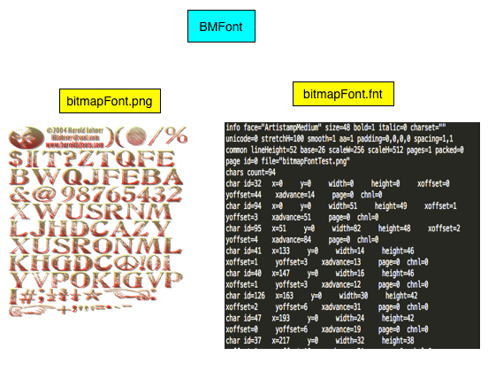
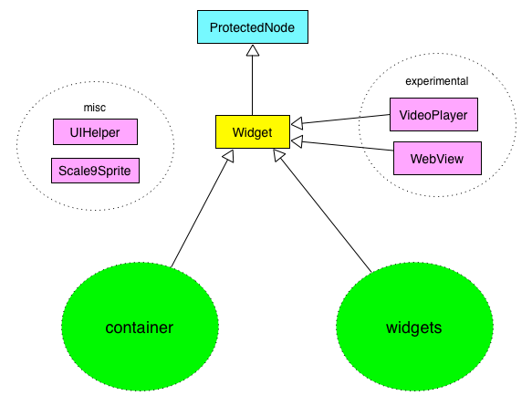
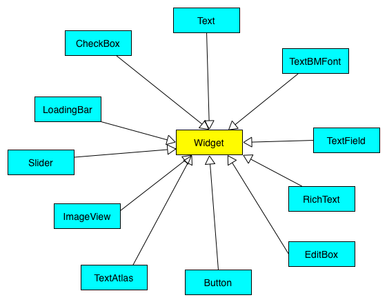
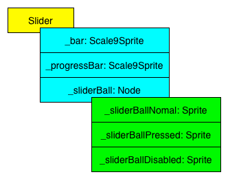

# UI

## Overview
In Cocos2d-x v3.x, we have three ways to deal with GUI programming:

- Label, Menu & MenuItem and TextFieldTTF, which have limited functions. But they are simple and easy to use.

- Control Extensions under extension module plus a simple ScrollView and TableView implementation. It also has a handy EditBox for text input

    **Note: Now, Since v3.3 beta, the EditBox class has been moved to UI module and the original `extensions::EditBox` has been marked as DEPRECATED. In the future release of cocos2d-x, the ScrollView and TableView will also be marked as DEPRECATED and we will provide alternative replacement in UI module.**

    The Control Extensions exists mainly for CocosBuilder. The parser of CocosBuilder uses this module heavily. There is also a very handy class in Control Extensions named Scale9Sprite which could help drawing slice 9 enabled sprite on screen. Now the Scale9Sprite is also marked as DEPRECATED and a replacement is `ui::Scale9Sprite` which has full functionality of the original one plus more features.

- The brand new UI module. The recommended way to handling GUI programming in Cocos2d-x.

So you might wondering:

> Which UI module should I choose when dealing with GUI programming in Cocos2d-x?

There is one rule:

> Always stick to the new UI module, because we also have an [UI editor](http://cocos2d-x.org/products#cocos-studio) to layout your UI elements visually.


## Label, Menu & MenuItem and TextFieldTTF
### Labels
#### Overview
Cocos2d-x v3 has unified the creation of Label into a single API. There are a few different types of Labels you can choose from: TTF, Atlas, BMFont and SystemFont.

The Label class is a huge monster at the first sight. And some of its APIs only work for certain type of Label and some of the APIs are only valid for certain type of Label. In order to use the new Label properly, we must understand the internals of what it really does.

> Note: In the new UI module, we have created three classes to handle different Label types. Such as: we use `ui::Text` to handle TTF and SystemFont rendering, we use `ui::TextAtlas` for rendering Atlas font and we use `ui::TextBMFont` to render BMFont. All of these classes use the `Label` internally.

Before digging into the details of each Label type, let's take a quick tour of the new Label rendering mechanism.

Here is the class hierarchy of Label:

 

From the above figure, we know Label is actually a SpriteBatchNode. When you feed a string into the Label class, it will generate one or more textures at first, depending on the size of the string and the Label type. We could simply treat each letter of the string as a single Sprite except for System font Label. When rendering occurs, all these single Sprite will be added into the SpriteBatchNode such that only one draw call will be issued to complete the font rendering.

All these Label types share a common rendering pipeline as shown below:

 

We will talk more about the details of the generated texture part in the following section.


#### Label Type
##### Label BMFont
  `BMFont` is a label type that uses a bitmap font. Bitmap fonts consist of a matrix of dots or pixels representing the image of each glyph in each face and size. It is very faster and easy to use, but non-scalable, requiring a separate font for each size.

As we know from the **Overview** part, the Label class is subclass from SpriteBatchNode. So we could treats each character like a Sprite. This means that each individual character can be:

- rotated
- scaled
- translated
- tinted
- change the opacity
- It can be used as part of a menu item.
- anchorPoint can be used to align the "label"
- Supports AngelCode text format

Limitations:
- All inner characters are using an anchorPoint of (0.5f, 0.5f) and it is not recommend to change it
because it might affect the rendering

In order to create a BMFont label, we should provide two files: A fooBar.fnt file and a fooBar.png file.

Here is a figure to show you what these two files look like:

 

The underline texture is created through the png file and the font information of each individual letter is store in the .fnt file.

Here is an sample code to create a BMFont Label:

```cpp
auto myLabel = Label::createWithBMFont("fooBar.fnt", "My Label Text");
```

All of the characters in the second parameter of the above function should be found in the provided "booBar.fnt" file, otherwise it won't be rendered.

Let's take the above code snippet as example. If the letter "e" is not in "fooBar.fnt", the final BMFont will be rendered to "My Labl Txt". And there is also a warning log in your debug output window.

When we create a BMFont label, the font face and font size is fixed. We could not change them unless we provide another ".fnt" and ".png" file and create a new BMFont label from them.

**Note: There is no `setFontSize` API to change the font size of a BMFont label , nor does it has a unified `setFontSize` API to change the font size of all the other label types.**

If you do want achieve different font size with only one BMFont label, you could call Node's `setScale` method. But the outcome might not be accepted. It is recommended to use different BMFont file to achieve the various font size.

BMFont is awesome, but we need tools to generate it. Please use any of these editors to generate BMFonts:

- http://glyphdesigner.71squared.com/ (Commercial, Mac OS X)

- http://www.n4te.com/hiero/hiero.jnlp (Free, Java)

- http://slick.cokeandcode.com/demos/hiero.jnlp (Free, Java)

- http://www.angelcode.com/products/bmfont/ (Free, Windows only)


##### Label TTF
`TTF` is a label type that uses a True Type Font. You must provide a True Type font file to feed the `Label::createWithTTF` function to create a TTF label.

The primary strength of TrueType was originally that it offered font developers a high degree of control over precisely how their fonts are displayed, right down to particular pixels, at various font sizes.

When we create a TTF Label , it will create a 512 * 512 texture at first and cache all the characters in the texture. When we change the Label text, it will search the character through the cached texture. If not found, it will create a new character and put it into the texture. When we reaches the size limit of the texture, we will create another 512 * 512 texture and cache the new character in it. Thus we could keep the memory foot print as minimal as possible and also improve text rendering speed.

Here is a figure to show you the above process:

 

As we can see, TTF label will cache font texture on demand. So it will not run as fast as BMFont when the displayed characters are not cached in the font texture. So if you just want to display a fixed character set like numbers or ASCII letters, and you don't want to change the font properties(font face or font size), you'd better use BMFont instead.

Here is the code to create a TTF Label with "myfont.ttf":

```cpp
//The 1st argument is the TTF font path, the 2nd argument is the label string you want to display, the 3rd argument is the font size
auto myLabel = Label::createWithTTF("myfont.ttf", "My Label Text", 16);
```       

We could also use a more complex way to create TTF labels:

```cpp
TTFConfig labelConfig;
labelConfig.fontFilePath = "myfont.ttf";
labelConfig.fontSize = 16;
labelConfig.glyphs = GlyphCollection::DYNAMIC;
labelConfig.outlineSize = 0;
labelConfig.customGlyphs = nullptr.
labelConfig.distanceFieldEnabled = false;
auto mylabel = Label::createWithTTF(labelConfig, "My Label Text");
```

The ``TTFConfig`` struct could give us more finer grained control to TTF label.

It is defined as below:

```cpp
typedef struct _ttfConfig
{
    std::string fontFilePath;
    int fontSize;
    GlyphCollection glyphs;
    const char *customGlyphs;
    bool distanceFieldEnabled;
    int outlineSize;

    _ttfConfig(const char* filePath = "",int size = 12, const GlyphCollection& glyphCollection = GlyphCollection::DYNAMIC,
        const char *customGlyphCollection = nullptr,bool useDistanceField = false,int outline = 0)
        :fontFilePath(filePath)
        ,fontSize(size)
        ,glyphs(glyphCollection)
        ,customGlyphs(customGlyphCollection)
        ,distanceFieldEnabled(useDistanceField)
        ,outlineSize(outline)
    {
        if(outline > 0)
        {
            distanceFieldEnabled = false;
        }
    }
}TTFConfig;
```

- `std::string fontFilePath`:   Specify the TTF font full path,it could be a relative path under the **search path** specified by `fileUtils->setSearchPaths(searchPaths);`.
- `int fontSize`: Specify the font size of the TTF font.
- `GlyphCollection glyphs`: Specify the GlyphCollection. There are current 4 different type of GlyphCollection you can choose from:

```cpp
enum class GlyphCollection {
    DYNAMIC,
    NEHE,
    ASCII,
    CUSTOM
};
```

The `DYNAMIC` means when creating a TTF label, no characters will be pre-cached. Only when rendering begins, all of the characters will be cached one by one. The `NEHE` means when creating a TTF label, the character set defined by NEHE will be pre-cached. And the `ASCII` is the same as `NEHE`, only the character set is different. The `CUSTOM` means we could provide a character set by ourselves. The `DYNAMIC` is the default option.  No matter what option you specified, when a character is not in the font texture cache, it will search the TTF font file at first, if found, the character will also be cached, otherwise, it won't be displayed at all.

- `customGlyphs`:  It is used along with the `GlyphCollection::CUSTOM`. It accepts a string of characters as input.
- `distanceFieldEnabled`: When we change the font size of a TTF label, we have two methods here. The default one is asking FreeType2 to generate the font atlas with the specified font size. The other one is by applying our own distance field algorithm achieve the same effect. But currently our distance field algorithm doesn't perform well. And when the outline size of the label is greater than 0, the distance field will be disable automatically.
- `outlineSize`: It is used to specify the border size of the outline effect. 

> So when should I use TTF font instead of BMFont?

There are two scenarios you should use the TTF label.

- You want to display CJK characters which can't be put into a few BMFont files.
- You want to display label with various font size and various font effect. 


##### Label SystemFont
`SystemFont` is a label type that usese the default system font and font size.

We could use the code below to create a SystemFont label:

```cpp
auto myLabel3 = Label::createWithSystemFont("My Label Text", "Arial", 16);
```

When we create a SystemFont label, the engine will call the system API to render the whole string as a single texture and draw it on your screen. Every time you change the character or the font properties of the label, a new texture will be created and the old one will be abandoned.

The figure here shows that the "HelloWorld" string is mapped to a whole texture.

 

So We can't treat each character of the label as a separate Sprite. And the rendering efficiency is also very low.

But it also has some advantages, such as it doesn't need extra space to store the font related files.

So do use the SystemFont to display some plain static information and do NOT use it for displaying rapid changing label in the game play which will harm your game FPS dramatically.

##### Label Atlas
`Label Atlas` is a label type that uses a atlas image file. When rendering a Atlas label, it will use the atlas file to generate a texture for rendering label strings. All the characters must be contained in the atlas file, otherwise it won't be rendered. And we could also treat each character of the label as a single Sprite.

Here is the figure to show you the font texture generated with Atlas label.

 


We could use the following code to create a new Atlas label:

```cpp
auto mylabl = Label::createWithCharMap("fonts/labelatlasimg.png",24,32,'0');
```

The 2rd and 3rd arguments of `Label::createWithCharMap` is the width and height of each character in the texture atlas file.

Here is the charmap png file, its dimension is 240 * 32 and it contains 10 numbers from 0-9, so each number occupy 24*32.


Atlas label versus BMFont label:
- Atlas label is simple version of BMFont label
- Atlas label is as fast as BMFont label.
- Atlas label has more limits to their character set.

Atlas label versus TTF label:
- Atlas label is MUCH faster than TTF label
- Atlas label "characters" have a fixed height and width
- Atlas label "characters" can be anything you want since they are taken from an image file

You could consider Label Atlas as a simple version of BMFont with limited font customization. It runs as fast as BMFont and usually used for displaying rapid changing game scores.

         
#### Label Effect
The new Label supports Shadow, Outline and Glow effect, here are the APIs to enable this effect:

```cpp
    /**
     * Enable shadow for the label
     *
     * @todo support blur for shadow effect
     */
    virtual void enableShadow(const Color4B& shadowColor = Color4B::BLACK,const Size &offset = Size(2,-2), int blurRadius = 0);

    /** only support for TTF, the System Font Outline effect only works on Android and IOS
    virtual void enableOutline(const Color4B& outlineColor,int outlineSize = -1);

    /** only support for TTF */
    virtual void enableGlow(const Color4B& glowColor);
```

As we see from the comments part, the Shadow effect is supported for all kind of Label types, but Outline effect only works well on all platform with TTF font, the SystemFont Outline effect only supports IOS and Android and the Glow effect only works with TTF font. That's because we use FreeType2 to rendering TTF font on various platform since v3.0.

So when applying the label effect, keeps an eye on these limitations.

#### Label Typesetting
##### Text Alignment
The new label support Horizontal and Vertical text alignment. The APIs are very straightforward:

```cpp
    void setAlignment(TextHAlignment hAlignment) { setAlignment(hAlignment,_vAlignment);}
    TextHAlignment getTextAlignment() const { return _hAlignment;}

    void setAlignment(TextHAlignment hAlignment,TextVAlignment vAlignment);

    void setHorizontalAlignment(TextHAlignment hAlignment) { setAlignment(hAlignment,_vAlignment); }
    TextHAlignment getHorizontalAlignment() const { return _hAlignment; }

    void setVerticalAlignment(TextVAlignment vAlignment) { setAlignment(_hAlignment,vAlignment); }
    TextVAlignment getVerticalAlignment() const { return _vAlignment; }
```
##### Line Wrap
The new label also supports **Line Wrap**, you could specify a dimension to your label, when a text line reach the boundary of the dimension, it will automatically break the current line.

```cpp
    /** Sets the max line width of the label.
     * The label's max line width be used for force line breaks if the set value not equal zero.
     * The label's width and max line width has not always to be equal.
     */
    void setMaxLineWidth(unsigned int maxLineWidth);
    unsigned int getMaxLineWidth() { return _maxLineWidth;}
    /** Sets the untransformed size of the label.
     * The label's width be used for text align if the set value not equal zero.
     * The label's max line width will be equal to the same value.
     */
    void setWidth(unsigned int width) { setDimensions(width,_labelHeight);}
    unsigned int getWidth() const { return _labelWidth; }  

    /** Sets the untransformed size of the label.
     * The label's height be used for text align if the set value not equal zero.
     * The text will display of incomplete when the size of label not enough to support display all text.
     */
    void setHeight(unsigned int height){ setDimensions(_labelWidth,height);}
    unsigned int getHeight() const { return _labelHeight;}   

    /** Sets the untransformed size of the label in a more efficient way. */
    void setDimensions(unsigned int width,unsigned int height);
    const Size& getDimensions() const{ return _labelDimensions;}
```

There is one more thing we should keep in mind. On default, the line break are word-wise operation which means when a word is reaching the boundary of the dimension,
if the remaining space is not enough for the word, the word will be put into the next new line. You could change this behavior by calling `setLineBreakWithoutSpace(true)` which is character-wise operation
and the word might be divided into two parts.


##### Line Height and Kerning
We could also change the line height when line wrap occurs. The API to change line height are:

```cpp
    /** Sets the line height of the label
      @warning Not support system font
      @since v3.2.0
     */
    void setLineHeight(float height);
    /** Returns the line height of this label
      @warning Not support system font
     */
    float getLineHeight() const;
```

**Caution: The SystemFont is currently not supported.**

If we want to trim the upper and bottom margin to reduce the height of the label, we could simple call this method:

```cpp
    void setClipMarginEnabled(bool clipEnabled) { _clipEnabled = clipEnabled; }
```

The character kerning could also be changed this way:

```cpp
    /** Sets the additional kerning of the label
      @warning Not support system font
      @since v3.2.0
     */
    void setAdditionalKerning(float space);
    /** Returns the additional kerning of this label
      @warning Not support system font
      @since v3.2.0
     */
    float getAdditionalKerning() const;
```

**Caution: The SystemFont is currently not supported.**


#### Tips & Tricks
- Please Don't use LabelTTF and LabelBMFont class, they are marked as DEPRECATED classes and will be removed in the future.

- When you want to change the color of the label text ,please use `setTextColor` instead of `setColor`, the latter will change the text color as well as the Shadow/Outline/Glow color. 

- Use `virtual Sprite * getLetter(int lettetIndex);` method to get each character of the label as a Sprite.(SystemFont is not supported.)


### Menu&Menu Items
A `Menu` is a way to navigate through game options. Menus often contain options like 'Play', 'Quit', 'Settings' and 'About'. This is usually in the form of buttons that are pressed.

#### What makes up a menu
A `Menu` is made up of a base node called `Menu`. It is easy to create a `Menu`.

```cpp
auto myMenu = Menu::create();
```        
#### Menu Items and adding to a Menu
`MenuItems` are the meat of any `Menu`.  Menu Items usually have a `normal` and a `selected` state as well as a callback...something that happens when the `MenuItem` is selected.

```cpp
// creating a menu with a single item
auto closeItem = MenuItemImage::create("CloseNormal.png", "CloseSelected.png", CC_CALLBACK_1(HelloWorld::menuCloseCallback, this));

Mneu* menu = Menu::create(closeItem, NULL);
this->addChild(menu, 1);

// creating a Menu from a Vector of items
Vector<MenuItem*> MenuItems;

auto closeItem = MenuItemImage::create("CloseNormal.png", "CloseSelected.png", CC_CALLBACK_1(HelloWorld::menuCloseCallback, this));

MenuItems.pushBack(closeItem);

/* repeat for as many menu items as needed */

auto menu = Menu::createWithArray(MenuItems);
this->addChild(menu, 1);
```

#### Lambdas as Menu callback
A lambda function is a function that you can write inline in your source code. Cocos2d-x makes use of Lambdas. You can even use them as callbacks!
```cpp
// a simple lambda
auto func = [] () { cout << "Hello world"; };
func(); // now call the function

// creating a CallFunc with a lambda
auto action1 = CallFunc::create(
[&](){
        std::cout << "using a Lambda callback" << std::endl;
    });
    
// creating an std::function using a lambda
std::function<void()> myFunction = []()
{
        std::cout << "From myFunction()" << std::endl;
};
auto action2 = CallFunc::create(myFunction);

// creating a MenuItemImage with a lambda callback
auto closeItem = MenuItemImage::create("CloseNormal.png", "CloseSelected.png", [&](Ref* sender){
                        // your code here
                     });
```

#### Various MenuItem Type
- MenuItemLabel
Supported label type:
  - Atlas
  - BMFont
  - SystemFont
  - TTF
  
Any Node that supports the LabelProtocol protocol can be added.
 
- MenuItemAtlasFont
It's a helper class to create a MenuItemLabel with a Atlas label.

- MenuItemFont
It's a helper class to create a MenuItemLabel with a SystemFont.

- MenuItemSprite
It's a MenuItem type accepts three different sprites(unselected, selected and disabled).

- MenuItemImage
It's a MenuItem type accepts three different images(unselected, selected and disabled). In the end, it will also create a MenuItemSprite.

- MenuItemToogle
 A simple container class that "toggles" it's inner items. The inner items can be any MenuItem


#### Layout of MenuItems
We could layout the MenuItems horizontally or vertically with or without padding. Here are the functions to deal with MenuItem layout:

```cpp
    /** align items vertically */
    void alignItemsVertically();
    /** align items vertically with padding
    @since v0.7.2
    */
    void alignItemsVerticallyWithPadding(float padding);

    /** align items horizontally */
    void alignItemsHorizontally();
    /** align items horizontally with padding
    @since v0.7.2
    */
    void alignItemsHorizontallyWithPadding(float padding);

    /** align items in rows of columns */
    void alignItemsInColumns(int columns, ...) CC_REQUIRES_NULL_TERMINATION;
    void alignItemsInColumns(int columns, va_list args);
    void alignItemsInColumnsWithArray(const ValueVector& rows);

    /** align items in columns of rows */
    void alignItemsInRows(int rows, ...) CC_REQUIRES_NULL_TERMINATION;
    void alignItemsInRows(int rows, va_list args);
    void alignItemsInRowsWithArray(const ValueVector& columns);

```
#### Limitations
Menu uses scene graph touch event listener to handle touch events. A touch event may not be handled properly when overlay occurs between menuItems: only the menuItem which has the highest ZOrder will receive the touch event.

So far so good, but it works badly with ScrollView, PageView and ListView, when the menuItem is outside of the clipping area of these parent container, the touch is still handled which is really weird.


### TextFieldTTF
#### What makes a TextFieldTTF
TextFieldTTF is a simple class for inputting text. It's a OpenGL implementation and works on all platform that cocos2d-x supports.
In fact, it's just a simple Label plus a few IME features.

Here is the class declaration:

```cpp
class CC_DLL TextFieldTTF : public Label, public IMEDelegate
{
    //other 
}
```

So TextField supports all the features of Label, such as Text Alignment, Line Wrap and Outline/Shadow/Glow effect in theory.

#### TextFieldTTF Features

- Create a TextFieldTTF with a placeholder:

```cpp
    _textField = TextFieldTTF::textFieldWithPlaceHolder("<click here for input>",
        FONT_NAME, //FONT_NAME is integer const define
        FONT_SIZE); //FONT_SIZE is also a integer const define
    //add _textField to the scene graph
    addChild(_textField);

    _textField->setDelegate(this);
    _textField->setPosition(Vec2(s.width / 2, s.height / 2));
```

- Let the TextFieldTTF supports TTF
On default, it will create the SystemFont label. You could call `virtual bool setTTFConfig(const TTFConfig& ttfConfig)` method to switch the label type to TTF label.

**Caution: After changing the TextFieldTTF from SystemFont to TTF, if the character you input can't be found in the TTF file. It won't be displayed but the TextFieldTTF do keep the character internally. Now if you delete the character, it seems nothing happened but the internal string indeed be deleted which is really weird.**

- Change Placeholder Text & Color

```cpp
    virtual void setColorSpaceHolder(const Color3B& color);
    virtual void setColorSpaceHolder(const Color4B& color);
    // place holder text property
    // place holder text displayed when there is no text in the text field.
    virtual void setPlaceHolder(const std::string& text);
    virtual const std::string& getPlaceHolder(void) const;
```

- Configure TextFieldTTF to display password

```cpp
    //Set true to display secure text
    virtual void setSecureTextEntry(bool value);
    //Query whether the TextFieldTTF is for inputting secure text
    virtual bool isSecureTextEntry();
```


#### Interactive with IME and related events
After the TextFieldTTF instance has been added to the scene graph, you must call the following method to pop up the keyboard for inputting.

```cpp
_textField->attachWithIME();
```

Similarly we could call the following method to close the keyboard.

```cpp
_textField->detachWithIME();
```

We could also implement the TextFieldDelegate to get notifications when the the Keyboard is attached or detached and also the input text event and delete text event.

Here is the full interface explanation:

```cpp
    /**
    @brief    If the sender doesn't want to attach to the IME, return true;
    */
    virtual bool onTextFieldAttachWithIME(TextFieldTTF * sender)
    
    /**
    @brief    If the sender doesn't want to detach from the IME, return true;
    */
    virtual bool onTextFieldDetachWithIME(TextFieldTTF * sender)

    /**
    @brief    If the sender doesn't want to insert the text, return true;
    */
    virtual bool onTextFieldInsertText(TextFieldTTF * sender, const char * text, size_t nLen)
    
    /**
    @brief    If the sender doesn't want to delete the delText, return true;
    */
    virtual bool onTextFieldDeleteBackward(TextFieldTTF * sender, const char * delText, size_t nLen)
```

#### Limitations:
Since the TextFieldTTF class is a subclass of Label, so it has all the limitations of Label.

- It doesn't have a blink cursor to indicator where we are inputting. Nor does it have the ability to change the start position of inputting. If you want this feature, try `ui::EditBox` instead.

- When the keyboard appears, it won't adjust your game view to get the best input experience. If you want this feature, try `ui::EditBox` instead.


## Control Extensions, extension::EditBox, extension::ScrollView and extension::TableView
### Overview
In this section, we will talk about all the Controls under `extensions/GUI/CCControlExtension` plus extra more discuss of extension::Scale9Sprite, extension::ScrollView, extension::TableView and extension::EditBox.

All of these classes are under extension namespace so if you want to use them ,please include the right header file and import the namespace:

```cpp
    #include"cocos-ext.h"
    using namespace extension.
```

### Control Extensions
The Control Extensions module was original designed for CocosBuilder and now it is not the recommended way to handling GUI programming and we don't plan to add any new features to these controls. So use them under your own risk.

There are many controls, such as ControlButton, ControlColorPicker, ControlSlider, ControlSwitch etc. Since they are not the recommended ways to handling UI programming, so we don't want to give more explanation to them. For more usage information, pleases refer to the [tests](https://github.com/cocos2d/cocos2d-x/tree/v3/tests/cpp-tests/Classes/ExtensionsTest/ControlExtensionTest).

**Limitation**: It doesn't handle touch event properly when controls become invisible only because they are outside of parent container's clipping area. 

### extension::Scale9Sprite
This class is marked as DEPRECATED since v3.3 beta and it is just a typedef of ui::Scale9Sprite.

```cpp
CC_DEPRECATED_ATTRIBUTE typedef ui::Scale9Sprite Scale9Sprite;
```

For more document of extension::Scale9Sprite, please refer to [ui::Scale9Sprite](#scale9sprite) section.


### extension::ScrollView
A ScrollView is a Layer which has a clipping area and an inner container with a fixed bounding area. We could add any node descendants to the ScrollView.
In fact, all the nodes are added into the inner container. We could drag the inner container to move it around. When some elements become outside of the clipping area, they will become invisible automatically which is really handy when display content large than the current screen size.

Here we could use the following method to create a ScrollView:

```cpp

    auto sprite = Sprite::create("HelloWorld.png");
    // the Size parameter is the clipping area size
    auto scrollView = ScrollView::create(Size(200,200));
    //we only create horizontal scroll enabled scrollview
    scrollView->setDirection(ScrollView::Direction::HORIZONTAL);
    scrollView->setPosition(Vec2(100,100));
    this->addChild(scrollView);
    //add a sprite to the scrollview, if the sprite's content size is larger than the clipping area of scrollview, only part of the sprite inside the clipping area will be visible
    scrollView->addChild(sprite);
```

The implementation of extension::ScrollView is not very good and the scroll behavior is also not very natural. So we designed a new ui::ScrollView instead. It has more features than the extension::ScrollView. In the future, the `extension::ScrolView` class will also be marked as DEPRECATED.

### extension::TableView
The `extension::TableView` is a very basic, minimal implementation to bring UITableView-like component into cocos2d-x.

It's a subclass of `extension::ScrollView`. It needs a DataSource delegate as the data input. 

When display data item, it will reuse TableCells when needed to increase the performance. So when you want to display a large portion of data, the `extension::TableView` is a good option here.

If you want to use `extension::TableView`, you must implement the `TableViewDataSource` delegate at first.

**Note**: Because we don't want to put UI code scatter cross the whole engine, so it will be merged into the UI module in the near future and more features will be added after merging.

In the following code, besides the DataSource protocol, we have also implemented the TableViewDelegate protocol which is used for handling which TableCell is been touched.

```cpp
class TableViewTestLayer : public Layer,public extension::TableViewDataSource, public extension::TableViewDelegate{
   //other stuff is omitted
    
    //TableViewDelegate method
    virtual void scrollViewDidScroll(extension::ScrollView* view) {};
    virtual void scrollViewDidZoom(extension::ScrollView* view) {}
    //TableViewDataSource method
    virtual void tableCellTouched(extension::TableView* table, extension::TableViewCell* cell);
    virtual Size tableCellSizeForIndex(extension::TableView *table, ssize_t idx);
    virtual extension::TableViewCell* tableCellAtIndex(extension::TableView *table, ssize_t idx);
    virtual ssize_t numberOfCellsInTableView(extension::TableView *table);
};

void TableViewTestLayer::tableCellTouched(TableView* table, TableViewCell* cell)
{
    CCLOG("cell touched at index: %ld", cell->getIdx());
}

Size TableViewTestLayer::tableCellSizeForIndex(TableView *table, ssize_t idx)
{
    if (idx == 2) {
        return Size(100, 100);
    }
    return Size(60, 60);
}

TableViewCell* TableViewTestLayer::tableCellAtIndex(TableView *table, ssize_t idx)
{
    auto string = String::createWithFormat("%ld", idx);
    TableViewCell *cell = table->dequeueCell();
    if (!cell) {
        cell = new (std::nothrow) CustomTableViewCell();
        cell->autorelease();
        auto sprite = Sprite::create("Images/Icon.png");
        sprite->setAnchorPoint(Vec2::ZERO);
        sprite->setPosition(Vec2(0, 0));
        cell->addChild(sprite);

        auto label = Label::createWithSystemFont(string->getCString(), "Helvetica", 20.0);
        label->setPosition(Vec2::ZERO);
        label->setAnchorPoint(Vec2::ZERO);
        label->setTag(123);
        cell->addChild(label);
    }
    else
    {
        auto label = (Label*)cell->getChildByTag(123);
        label->setString(string->getCString());
    }


    return cell;
}

ssize_t TableViewTestLayer::numberOfCellsInTableView(TableView *table)
{
    return 20;
}
```

Here is the code to create a TableView: we create a TableView with size 60 * 250 and set the TableViewDataSource to the `this` pointer which is a TableViewTestLayer instance. Then we set the ScrollDirection to VERTICAL. we also set the delegate class to the TableViewTestLayer. At last, we call `reloadData` method to tell the TableView to fill in the control with the data from TableViewdataSource.

```cpp
    tableView = TableView::create(this, Size(60, 250));
    tableView->setDirection(ScrollView::Direction::VERTICAL);
    tableView->setPosition(Vec2(winSize.width-150,winSize.height/2-120));
    tableView->setDelegate(this);
    tableView->setVerticalFillOrder(TableView::VerticalFillOrder::TOP_DOWN);
    this->addChild(tableView);
    tableView->reloadData();
```


### extension::EditBox
This class is marked as DEPRECATED since v3.3 beta and it is just a typedef of ui::EditBox:

```cpp
CC_DEPRECATED_ATTRIBUTE typedef ui::EditBox EditBox;
CC_DEPRECATED_ATTRIBUTE typedef ui::EditBoxDelegate EditBoxDelegate;
```

For more document of extension::EditBox, please refer to [ui::EditBox](#editbox) section.

## New GUI Module
### Overview
The new GUI module is a widget-based GUI framework, it was original designed for [CocosStudio](http://www.cocos2d-x.org/wiki/CocoStudio).
It tries to break the stalemate that cocos2d-x lack a well defined, official supported featured GUI solution. We know GUI framework design is a hard topic for us, but we will improve it with the community.

Now it is the only GUI module under actively developed. New features will be added continually and bug report will be quickly responded. So when you are dealing with GUI programming, please give it a try. 

In this section, we show you the architecture of the GUI module and the features it provides.

#### Architecture
The root class of the new GUI module is `ui::Widget` which is inherited from `ProtectedNode`. A ProtectedNode is designed for holding inner Node list such that when you are adding or removing child node from the ProtectedNode, the "Innder Node List" won't be touched which is safe to keep widget's inner rendering components.

We could simply divide the GUI module into two parts:  the general Widget part and the Container part.

Here is a figure to show you the big picture:

 

From the picture, we can see that besides the *container* and *widgets* parts, we also have *misc* and *experimental* parts.

The *misc* part provide some auxiliary function for the rest of UI module, such as slice 9 enabled sprite drawing, finding child widget by name recursively etc.

The *experimental* part is intent for putting none cross platform Widgets. The VideoPlyaer and WebView are two very handy and ready to use widget type, but they only works for iOS and Android. We will take about these two Widget later in the end of document.

Now, we will take a look at the *Container* part. Here is the figure:

 

The `Layout` class is the root class of all containers. It is also inherited from Widget. Layout class exists mainly for arranging children widgets and clipping. It also supports background color and background image which is handy when layout it on a UI editor.

The `LayoutManager`, `LayoutParameter` and `Margin` classes are used for layout elements. `HBox`, `VBox` and `RelativeBox` are handy classes for layout children widgets horizontally, vertically and relatively.

The `ScrolView`, `ListView` and `PageView` are specific containers for certain usage scenario. We will talk it in another section.

At last, we will take a look at the *Widgets* part. It contains many handy widget to help our daily GUI programming.

Here is a figure contains all the widgets:

 

We will discuss these widgets in detail in the next sections.


All of these Widget class share the same model below:

 

They are all ProtectedNode with a few nodes as their inner rendering components. We will talk about the details of each Widget class in detail.


#### Feature List
1. **Touch event capturing mimic.**

    The current touch event model of cocos2d-x only support *bubble* which means the touch event is received at the target node and bubble to its parents. There is no *capture* phase as compare to the [DOM event model](http://www.w3.org/TR/DOM-Level-2-Events/events.html).
    Consider a use scenario, we have a ScrollView and a few buttons added, if we click the button, the touch event won't be passed to the ScrollView(That's because all the widget class swallow touches.). If we want to click the button and drag to move the ScrollView, the ScrolView won't be dragged which is not the desired behavior.
    The new UI module solve this problem and we could drag the element within ScrollView(ListView,PageView) to move the container.

2. **Clipping: stencil VS scissor.**

    The Layout class and its descendants supports two types of clipping: stencil and scissor.
    When we enable clipping, the child element in Layout will only be show inside the bounds of Layout.(But the draw call is still the same.)

3. **UTF8 support.**

    When dealing with text display and text input, UTF8 support is a must have feature. All the text related classes in new UI module support UTF8.

4. **Percent positioning and percent content size.**

    Percent positioning is a handy way to position widget. When you want to positioning the child widget always to the right top corner of its parents. We could simply set the child widget's position type to `PositionType::PERCENT` and set the *PercentPosition* to `Vec2(1,1)`.
    Percent content size is similar to percent position. If we want a child widget's content size always equal to the half content size of its partent, we could specify the child widget's size type to `SizeType::PERCENT` and set the *SizePercent* to `Vec2(0.5,0.5)`.


5. **Widget state management.**

    In general, a Widget will contains three state: Normal, Active(Pressed) and Disabled. All the widgets in the new UI module take care of the state management and change their appearance accordingly to the state switch.

6. **Widget focus.**

    When you have a few widgets on the screen, you might want one of them to be focused and you could simply specify the focus change direction, the framework will do the rest for you to move the focus to the next proper widget and provide you a callback when focus change happens. This feature is very helpful if you want to use cocos2d-x to program OTT UI interface.

7. **Layout widgets.**

    Layout is a must have feature in any UI framework. Currently the new UI module supports Horizontal, Vertical and Relative Layout.
We could also specify the *Margin* property of each widget, these proper will be calculated during layouting.

If you don't want to implement these features by yourself, you might give the new UI module a try.


### Scale9Sprite
This class is heavily used by the new UI module as well as the Control Extension module. When you want to stretch a image dynamically accordingly to the device screen resolution, the normal scale operation doesn't work very well, Scale9Sprite comes to rescue.

We could use the following code to create a patch 9 sprite easily:

```cpp
        auto sprite_scaled_with_insets = Sprite::create("Images/blocks9.png");
        auto blocks_scaled_with_insets = ui::Scale9Sprite::create();
        blocks_scaled_with_insets->updateWithSprite(sprite_scaled_with_insets, Rect(0, 0, 96, 96), false, Rect(32, 32, 32, 32));
        blocks_scaled_with_insets->setContentSize(Size(96 * 4.5, 96 * 2.5));
        blocks_scaled_with_insets->setPosition(Vec2(x, y));
        this->addChild(blocks_scaled_with_insets);
```

This code create a patch 9 sprite with capInset equals to `Rect(32, 32, 32, 32)`, the rectangle divide the whole sprite into 9 parts. The internal implementation of ui::Scale9Sprite do use 9 sprites to represent each part.

when the patch 9 sprite is stretching, the 4 sprite in the corner will stay the same, the 4 sprites in top,left,right and down will only stretch in one direction, either horizontal or vertical. The inner most sprite will stretch in two directions.

Here is the figure to show you the above process:

 


You might also want to take a look at [this article](http://yannickloriot.com/2013/03/9-patch-technique-in-cocos2d/), it was written for CCScale9Sprite of cocos2d-iphone, but the theory behind is more or less the same as ui::Scale9Sprite.

For more usage of Scale9Sprite, please take a look at the [UIScale9SpriteTest](https://github.com/cocos2d/cocos2d-x/blob/v3/tests/cpp-tests/Classes/UITest/CocoStudioGUITest/UIScale9SpriteTest.cpp)

### Buttons
A button intercepts touch event and calls a predefined callback when tapped. It is inherited from `ui::Widget`. This class provide methods for setting the title, image and other properties of button.

Before digging into the details of `ui::Button`, let's take a quick tour of its architecture.

#### Architecture
A button is a ProtectedNode node along with a few inner rendering components, here is the figure:

 

On default, only the normal state sprite and the title label will be displayed. When you tap the button, the state will change from **normal** to **pressed** and its appearance will be changed accordingly.

#### Example
Here is the code to create a button with two images, a title and a callback.

```cpp
    // the third parameter is optional
    Button* button = Button::create("cocosui/animationbuttonnormal.png",
                                        "cocosui/animationbuttonpressed.png");
    button->setTitleText("Text Button");
    button->setPosition(Point(widgetSize.width / 2.0f, widgetSize.height / 2.0f));
    // here we could also pass a lambda as callback
    button->addTouchEventListener(CC_CALLBACK_2(UIButtonTest::touchEvent, this));        
    this->addChild(button);
```

For more usage tests, please refer to [UIButtonTest](https://github.com/cocos2d/cocos2d-x/blob/v3/tests/cpp-tests/Classes/UITest/CocoStudioGUITest/UIButtonTest/UIButtonTest.cpp) for more information.

#### Tips and tricks
- Change the zoom scale
  On default, when you tap a button, it will zoom to a specified size. You could call `setZoomScale` to change the default behavior.

- Button Vs Menu
We could use Menu to create a few buttons easily, but it doesn't work well with ScrollView and ListView. When you added a Menu into the ScrollView, even if the MenuItem is outside of the clipping area.
It still responds to touch event which is weird. So do use Button when you want to work with ScrollView like containers.

- Button Vs ControlButton
The ControlButton should not be your first consideration. It is designed for CocosBuilder and it has the same flaw as Menu when using inside a ScrollView like container.


### CheckBox
A checkbox permits the user to make a binary choice.

#### Architecture
A checkbox contains five node as its inner rendering components.

 

These five components are explained as below:

-  groundBoxNormal
 

- groundBoxSelected
 

- groundBoxDisabled


- frontCrossNormal


- frontCrossDisabled
 


#### Example
Here is the code snippets to create a simple checkBox:

```cpp
        // Create the checkbox
        CheckBox* checkBox = CheckBox::create("cocosui/check_box_normal.png",
                                              "cocosui/check_box_normal_press.png",
                                              "cocosui/check_box_active.png",
                                              "cocosui/check_box_normal_disable.png",
                                              "cocosui/check_box_active_disable.png");
        checkBox->setPosition(Vec2(widgetSize.width / 2.0f, widgetSize.height / 2.0f));
        //when user check or uncheck the widget, the following callback will be called. 
        checkBox->addEventListener(CC_CALLBACK_2(UICheckBoxTest::selectedEvent, this));
        _uiLayer->addChild(checkBox);
```

### LoadingBar
A loading bar could be used to visualize the progression of an operation, such as download, file transfer etc.
The loading bar has two direction(LEFT or RIGHT).

#### Architecture
The LoadingBar contains a Scale9Sprite as its progress indicator, here is the figure to show you the relationship:

 


#### Example
Here is the code snippet to create a loading bar:

```cpp
        // Create the loading bar
        LoadingBar* loadingBar = LoadingBar::create("cocosui/sliderProgress.png");
        loadingBar->setDirection(LoadingBar::Direction::RIGHT);
        loadingBar->setPosition(Vec2(widgetSize.width / 2.0f,
                                      widgetSize.height / 2.0f + loadingBar->getContentSize().height / 4.0f));
        _uiLayer->addChild(loadingBar);
```


### Slider
A Slider(track bar) allows user to set value by moving a indicator.

#### Architecture
A slider contains a Scale9Sprite as background and a Scale9Sprite as the progress indicator. It also contains a ball to allow user touch and drag. The ball renderer is just a Node with three Sprites as children.

Here is the figure to show you the inner rendering components of Slider:

 


#### Example
Here is the code snippet to create a slider :

```cpp
        Slider* slider = Slider::create();
        slider->loadBarTexture("cocosui/sliderTrack.png");
        slider->loadSlidBallTextures("cocosui/sliderThumb.png", "cocosui/sliderThumb.png", "");
        slider->loadProgressBarTexture("cocosui/sliderProgress.png");
        slider->setPosition(Vec2(widgetSize.width / 2.0f, widgetSize.height / 2.0f/* + slider->getSize().height * 2.0f*/));
        slider->addEventListener(CC_CALLBACK_2(UISliderTest::sliderEvent, this));
        _uiLayer->addChild(slider);
```


### ImageView
A ImageView is a placeholder for displaying images. It wraps a Scale9Sprite as its inner renderer, so we could call `setScale9Enabled` method to draw 9-patch images. It it inherited from `ui::Widget` class, so it supports touch event, focus, percent positioning and percent content size.

#### Architecture
A ImageView contains a Scale9Sprite as inner rendering component.

 

#### Example
The usage of ImageView is very straightforward, here is the code snippet:

- Create a ImageView from a file:

```cpp
        ImageView* imageView = ImageView::create("cocosui/ccicon.png");
        imageView->setPosition(Vec2(widgetSize.width / 2.0f,
                                     widgetSize.height / 2.0f));
        _uiLayer->addChild(imageView);
```

- Create a ImageView from a SpriteFrame name:

```cpp
        ImageView* imageView = ImageView::create("cocosui/ccicon.png", TextureResType::PLIST);
        imageView->setPosition(Vec2(widgetSize.width / 2.0f,
                                     widgetSize.height / 2.0f));
        _uiLayer->addChild(imageView);
```


### Text
A Text widget is used for display texts. You could also use it as a Text-only button.  It is also inherited from Widget class ,so it supports touch event, focus, percent positioning and percent content size.

#### Architecture
A Text contains a Label as inner rendering component, so it supports all the feature of Label, such as Shadow, Outline and Glow. It also supports TTF and SystemFont.

 

#### Example

- Create Text with SystemFont:

```cpp
        Text* text = Text::create("Text", "AmericanTypewriter", 30);
        text->setPosition(Vec2(widgetSize.width / 2.0f, widgetSize.height / 2.0f + text->getContentSize().height / 4.0f));
        _uiLayer->addChild(text);
```

- Create Text With TrueType Font:

```cpp
        Text* text = Text::create("Text","fonts/A Damn Mess.ttf",30);
        text->setPosition(Vec2(widgetSize.width / 2.0f, widgetSize.height / 2.0f + text->getContentSize().height / 4.0f));
        _uiLayer->addChild(text);
```

- Enable effects on Text:

```cpp
        // create the shadow only label
        Text* shadow_label = Text::create();
        shadow_label->enableShadow();
        shadow_label->setString("Shadow");
        shadow_label->setPosition(Vec2(widgetSize.width / 2.0f, widgetSize.height / 2.0f + shadow_label->getContentSize().height));
        _uiLayer->addChild(shadow_label);
        
        // create the stroke only label
        Text* glow_label = Text::create();
        glow_label->setFontName("fonts/Marker Felt.ttf");
        glow_label->setString("Glow");
        glow_label->enableGlow(Color4B::RED);
        glow_label->setPosition(Vec2(widgetSize.width / 2.0f, widgetSize.height / 2.0f));
        
        _uiLayer->addChild(glow_label);
        
        
        // create the label stroke and shadow
        Text* outline_label = Text::create();
        outline_label->enableOutline(Color4B::BLUE, 2);
        outline_label->setString("Outline");
        outline_label->setPosition(Vec2(widgetSize.width / 2.0f, widgetSize.height / 2.0f - shadow_label->getContentSize().height));
        _uiLayer->addChild(outline_label);
```

- Use Text as a text-only button:

```cpp
    auto text = Text::create("Click Me", "Arial", 20);
    //call this method will zoom the text when tapped
    text->setTouchScaleChangeEnabled(true);
    // Text doesn't enable touch on default
    text->setTouchEnabled(true);
    text->addClickEventListener([=](Ref*){
        CCLOG("clicked");
    });
    text->setPosition(Vec2(100,100));
    this->addChild(text, 20);
```


### TextBMFont
A TextBMFont widget is used for display BMFont texts. It is also inherited from Widget class, so it supports touch event, focus, percent positioning and percent content size.

#### Architecture
A TextBMFont contains a Label as inner rendering component.

 

#### Example

Here is a code snippet to create a TextBMFont from a Bitmap Font file:

```cpp
        TextBMFont* textBMFont = TextBMFont::create("BMFont", "cocosui/bitmapFontTest2.fnt");
        textBMFont->setPosition(Vec2(widgetSize.width / 2, widgetSize.height / 2.0f + textBMFont->getContentSize().height / 8.0f));
        _uiLayer->addChild(textBMFont);
```


### TextAtlas
A TextAtlas widget is used for display atlas font. It is also inherited from Widget class, so it supports touch event, focus, percent positioning and percent content size.
#### Architecture
A TextAtlas contains a Label as inner rendering component:

 

#### Example

Here is a code snippet to create a TextAtlas from a atlas font file:

```cpp
        TextAtlas* textAtlas = TextAtlas::create("1234567890", "cocosui/labelatlas.png", 17, 22, "0");
        textAtlas->setPosition(Vec2((widgetSize.width) / 2, widgetSize.height / 2.0f));
        _uiLayer->addChild(textAtlas);                
```

### RichText
A RichText widget is used for displaying text, image and custom node.  It is inherited from Widget class, so it supports touch event, focus, percent positioning and percent content size. Note: the touch event is received by the whole RichText not the individual RichElement. The clickable RichElement will be supported in the future.

#### Architecture
RichText holds a vector of RichElement as its inner rendering components:

 


#### Example
Here is a quick sample code to create the RichText:

```cpp
        _richText = RichText::create();
        _richText->ignoreContentAdaptWithSize(false);
        _richText->setContentSize(Size(100, 100));
        
        RichElementText* re1 = RichElementText::create(1, Color3B::WHITE, 255, str1, "Marker Felt", 10);
        RichElementText* re2 = RichElementText::create(2, Color3B::YELLOW, 255, "And this is yellow. ", "Helvetica", 10);
        RichElementText* re3 = RichElementText::create(3, Color3B::GRAY, 255, str2, "Helvetica", 10);
        RichElementText* re4 = RichElementText::create(4, Color3B::GREEN, 255, "And green with TTF support. ", "fonts/Marker Felt.ttf", 10);
        RichElementText* re5 = RichElementText::create(5, Color3B::RED, 255, "Last one is red ", "Helvetica", 10);
        
        RichElementImage* reimg = RichElementImage::create(6, Color3B::WHITE, 255, "cocosui/sliderballnormal.png");
        
        cocostudio::ArmatureDataManager::getInstance()->addArmatureFileInfo("cocosui/100/100.ExportJson");
        cocostudio::Armature *pAr = cocostudio::Armature::create("100");
        pAr->getAnimation()->play("Animation1");
        
        RichElementCustomNode* recustom = RichElementCustomNode::create(1, Color3B::WHITE, 255, pAr);
        RichElementText* re6 = RichElementText::create(7, Color3B::ORANGE, 255, "Have fun!! ", "Helvetica", 10);
        _richText->pushBackElement(re1);
        _richText->insertElement(re2, 1);
        _richText->pushBackElement(re3);
        _richText->pushBackElement(re4);
        _richText->pushBackElement(re5);
        _richText->insertElement(reimg, 2);
        _richText->pushBackElement(recustom);
        _richText->pushBackElement(re6);
        
        _richText->setPosition(Vec2(widgetSize.width / 2, widgetSize.height / 2));
        _richText->setLocalZOrder(10);
        
        _widget->addChild(_richText);
```

Here is the screenshot:

 


#### Limitations
- It only supports manually RichElement arrangement now, the HTML tag based creation will be added in the future.
- Various text effects are also not supported.
- The clickable RichElement is also absent at the moment.

### TextField
A TextField Widget is used for inputting text. It is inherited from Widget class, so it supports touch event, focus, percent positioning and percent content size.

#### Architecture
The TextField class contains a UICCTextFieldTTF as its inner rendering component, the UICCTextFieldTTF is inherited from TextFieldTTF and implements the `TextFieldDelegate`.


 


#### Example
Here is the code snippet to create a TextField:

```cpp
        TextField* textField = TextField::create("input words here","Arial",30);
        textField->setPosition(Vec2(widgetSize.width / 2.0f, widgetSize.height / 2.0f));
        textField->addEventListener(CC_CALLBACK_2(UITextFieldTest::textFieldEvent, this));
        _uiLayer->addChild(textField);

        void UITextFieldTest::textFieldEvent(Ref *pSender, TextField::EventType type)
        {
            switch (type)
            {
                case TextField::EventType::ATTACH_WITH_IME:
                {
                     //do something
                }
                    break;

                case TextField::EventType::DETACH_WITH_IME:
                {
                }
                    break;

                case TextField::EventType::INSERT_TEXT:
                    break;

                case TextField::EventType::DELETE_BACKWARD:
                    break;

                default:
                    break;
            }
        }
```

### ScrollView
A ScrollView widget is a container which could hold many child widget, the display area is usually smaller than its inner container. So it is a good option to display large portion of elements within a small screen size.

#### Architecture
A ScrollView is a Layout with clipping enabled, it contains another Layout as its inner container. All the elements will be added into the inner container instead of the ScrollView itself.

 


#### Example

```cpp
        // Create the scrollview by vertical
        ui::ScrollView* scrollView = ui::ScrollView::create();
        scrollView->setContentSize(Size(280.0f, 150.0f));
        Size backgroundSize = background->getContentSize();
        scrollView->setPosition(Vec2((widgetSize.width - backgroundSize.width) / 2.0f +
                               (backgroundSize.width - scrollView->getContentSize().width) / 2.0f,
                               (widgetSize.height - backgroundSize.height) / 2.0f +
                               (backgroundSize.height - scrollView->getContentSize().height) / 2.0f));
        _uiLayer->addChild(scrollView);
        
        ImageView* imageView = ImageView::create("cocosui/ccicon.png");
        
        float innerWidth = scrollView->getContentSize().width;
        float innerHeight = scrollView->getContentSize().height + imageView->getContentSize().height;
        
        scrollView->setInnerContainerSize(Size(innerWidth, innerHeight));                
        
        Button* button = Button::create("cocosui/animationbuttonnormal.png", "cocosui/animationbuttonpressed.png");
        button->setPosition(Vec2(innerWidth / 2.0f, scrollView->getInnerContainerSize().height - button->getContentSize().height / 2.0f));
        scrollView->addChild(button);
        
        Button* titleButton = Button::create("cocosui/backtotopnormal.png", "cocosui/backtotoppressed.png");
        titleButton->setTitleText("Title Button");
        titleButton->setPosition(Vec2(innerWidth / 2.0f, button->getBottomBoundary() - button->getContentSize().height));
        scrollView->addChild(titleButton);
        
        Button* button_scale9 = Button::create("cocosui/button.png", "cocosui/buttonHighlighted.png");
        button_scale9->setScale9Enabled(true);
        button_scale9->setContentSize(Size(100.0f, button_scale9->getVirtualRendererSize().height));
        button_scale9->setPosition(Vec2(innerWidth / 2.0f, titleButton->getBottomBoundary() - titleButton->getContentSize().height));
        scrollView->addChild(button_scale9);
        
        imageView->setPosition(Vec2(innerWidth / 2.0f, imageView->getContentSize().height / 2.0f));
        scrollView->addChild(imageView);            
```

Here is the screenshot:


### ListView
A ListView is a widget which show items in horizontal or vertical. ListView is inherited from ScrollView, but it only supports horizontal and vertical scrolling.

#### Architecture
Here is the figure to show you the class hierarchy of ListView:

 

#### Example

Here is a code snippet to show you how to create a ListView with few buttons. In the following code, we also enable bouncing and touch along side with a background image.

```cpp
        // Create the list view ex
        ListView* listView = ListView::create();
        // set list view ex direction
        listView->setDirection(ui::ScrollView::Direction::HORIZONTAL);
        listView->setTouchEnabled(true);
        listView->setBounceEnabled(true);
        listView->setBackGroundImage("cocosui/green_edit.png");
        listView->setBackGroundImageScale9Enabled(true);
        listView->setContentSize(Size(240, 130));
        listView->setPosition(Vec2(240,160));
        listView->addEventListener((ui::ListView::ccListViewCallback)CC_CALLBACK_2(UIListViewTest_Horizontal::selectedItemEvent, this));
        this->addChild(listView);
        //add listview items into the ListView
        
        // add custom item
        for (int i = 0; i < count / 4; ++i)
        {
            Button* custom_button = Button::create("cocosui/button.png", "cocosui/buttonHighlighted.png");
            custom_button->setName("Title Button");
            custom_button->setScale9Enabled(true);
            custom_button->setContentSize(default_button->getContentSize());
            
            Layout* custom_item = Layout::create();
            custom_item->setContentSize(custom_button->getContentSize());
            custom_button->setPosition(Vec2(custom_item->getContentSize().width / 2.0f, custom_item->getContentSize().height / 2.0f));
            custom_item->addChild(custom_button);
            
            listView->pushBackCustomItem(custom_item);
        }
        // insert custom item

```

### PageView
A PageView is used as a container to display contents which we could view them as tuning book pages. 
#### Architecture
The PageView is inherited from Layout and it contains a vector of Layout as its pages.

 

#### Example
Here is the code to create a PageView with three pages:

```cpp
        // Create the page view
        PageView* pageView = PageView::create();
        pageView->setContentSize(Size(240.0f, 130.0f));
        Size backgroundSize = background->getContentSize();
        pageView->setPosition(Vec2(100,100));
        
        int pageCount = 3;
        for (int i = 0; i < pageCount; ++i)
        {
            Layout* layout = Layout::create();
            layout->setContentSize(Size(240.0f, 130.0f));
            
            ImageView* imageView = ImageView::create("cocosui/scrollviewbg.png");
            imageView->setScale9Enabled(true);
            imageView->setContentSize(Size(240, 130));
            imageView->setPosition(Vec2(layout->getContentSize().width / 2.0f, layout->getContentSize().height / 2.0f));
            layout->addChild(imageView);
            
            pageView->insertPage(layout,i);
        }
        
        pageView->addEventListener(CC_CALLBACK_2(UIPageViewTest::pageViewEvent, this));
        
        _uiLayer->addChild(pageView);
```

### Layout
The Layout class exists mainly for three reasons: as a Layout container, as a clipping layer and as a focus helper class. In this section, we will mainly talk about the container and clipping part. The Focus functionality will be talked in a separated section.

In order to understand the Layout feature of Layout class, we should first take a loot at the LayoutParameter and LayoutManager class.

#### LayoutParameter
Every Widget class could have a LayoutParameter property. There are two types of LayoutParameter:
LinearLayoutParameter and RelativeLayoutParameter, they are used for horizontal/vertical layout and Relative layout.

#### LayoutManger
LayoutManager is the class which takes care of the actually layout operation. There are `LiearVerticalLayoutManager`, `LinearHorizontalLayoutManager` and `RelativeLayoutManger` which are used for vertical, horizontal and relative layout respectively.

#### HBOX , VBox & RelativeBox
The HBox is just a Layout with layout type equal `Layout::Type::HORIZONTAL`, the VBox is also a layout with layout type equals `Layout::Type::VERTICAL` and  the RelativeLayout is just a Layout with layout type equals `Layout::Type::Relative`.

There are all handy class for layout elements.  And we also use HBox & VBox to manage the focus of our UI interface. 


#### Example
Here is a code snippet to create a linear vertical layout.

```cpp
        // Create the layout
        Layout* layout = Layout::create();
        layout->setLayoutType(LayoutType::VERTICAL);
        layout->setContentSize(Size(280, 150));
        Size backgroundSize = background->getContentSize();
        layout->setPosition(Vec2(200,150));
        _uiLayer->addChild(layout);
        
        
        Button* button = Button::create("cocosui/animationbuttonnormal.png", "cocosui/animationbuttonpressed.png");
        layout->addChild(button);
        
        LinearLayoutParameter* lp1 = LinearLayoutParameter::create();
        button->setLayoutParameter(lp1);
        lp1->setGravity(LinearLayoutParameter::LinearGravity::CENTER_HORIZONTAL);
        lp1->setMargin(Margin(0.0f, 5.0f, 0.0f, 10.0f));
        
        
        Button* titleButton = Button::create("cocosui/backtotopnormal.png", "cocosui/backtotoppressed.png");
        titleButton->setTitleText("Title Button");
        layout->addChild(titleButton);
        
        LinearLayoutParameter* lp2 = LinearLayoutParameter::create();
        titleButton->setLayoutParameter(lp2);
        lp2->setGravity(LinearLayoutParameter::LinearGravity::CENTER_HORIZONTAL);
        lp2->setMargin(Margin(0.0f, 10.0f, 0.0f, 10.0f));
        
        
        Button* button_scale9 = Button::create("cocosui/button.png", "cocosui/buttonHighlighted.png");
        button_scale9->setScale9Enabled(true);
        button_scale9->setContentSize(Size(100.0f, button_scale9->getVirtualRendererSize().height));
        layout->addChild(button_scale9);
        
        LinearLayoutParameter* lp3 = LinearLayoutParameter::create();
        button_scale9->setLayoutParameter(lp3);
        lp3->setGravity(LinearLayoutParameter::LinearGravity::CENTER_HORIZONTAL);
        lp3->setMargin(Margin(0.0f, 10.0f, 0.0f, 10.0f));
```

For more usage of Layout class, please refer to [UILayoutTest](https://github.com/cocos2d/cocos2d-x/blob/v3/tests/cpp-tests/Classes/UITest/CocoStudioGUITest/UILayoutTest/UILayoutTest.cpp) for more information.

### EditBox
EditBox is a widget for text input, the main difference between EditBox and TextField is EditBox calls system control to handle input task. We call the platform dependent API to rendering the DeitBox and do text input.

Here is the sample usage:

```cpp
        _editName = ui::EditBox::create(editBoxSize, ui::Scale9Sprite::create(pNormalSprite));
        _editName->setPosition(Vec2(visibleOrigin.x+visibleSize.width/2, visibleOrigin.y+visibleSize.height*3/4));
        _editName->setFontName("Paint Boy");
        _editName->setFontSize(25);
        _editName->setFontColor(Color3B::RED);
        _editName->setPlaceHolder("Name:");
        _editName->setPlaceholderFontColor(Color3B::WHITE);
        _editName->setMaxLength(8);
        _editName->setReturnType(ui::EditBox::KeyboardReturnType::DONE);
        _editName->setDelegate(this);
        addChild(_editName);
```

For more usage of EditBox, please refer to [UIEditBoxTest](https://github.com/cocos2d/cocos2d-x/blob/v3/tests/cpp-tests/Classes/UITest/CocoStudioGUITest/UIEditBoxTest.cpp).

### VideoPlyaer
ViedoPlayer is a widget to play videos inside your game.

*Note*: Currently it only supports iOS and Android, so we put it under the ui::experimental namespace which is not mean the feature we provided is not mature but only due to the lack of full cross platform support.

Here is the sample code to create a VideoPlayer control:

```cpp
    _videoPlayer = VideoPlayer::create();
    _videoPlayer->setPosition(centerPos);
    _videoPlayer->setAnchorPoint(Vec2::ANCHOR_MIDDLE);
    _videoPlayer->setContentSize(Size(widgetSize.width * 0.4f,widgetSize.height * 0.4f));
    _uiLayer->addChild(_videoPlayer);
    
    _videoPlayer->addEventListener(CC_CALLBACK_2(VideoPlayerTest::videoEventCallback, this));
```

To play a local video file, you could call `setFileName`,. To play a video from a remote machine, you could call `setURL`. 

For more usage of VideoPlayer, please refer to [ UIVideoPlayerTest ](https://github.com/cocos2d/cocos2d-x/blob/v3/tests/cpp-tests/Classes/UITest/CocoStudioGUITest/UIVideoPlayerTest/UIVideoPlayerTest.cpp).

### WebView
WebView is a widget to display web pages inside your game.

*Note*: Currently it only supports iOS and Android, so we put it under the ui::experimental namespace which is not mean the feature we provided is not mature but only due to the lack of full cross platform support.

Here is the sample code to create a WebView control, it will visit google after scene enters.

```cpp
        _webView = experimental::ui::WebView::create();
        _webView->setPosition(winSize/2);
        _webView->setContentSize(winSize * 0.5);
        _webView->loadUrl("http://www.google.com");
        _webView->setScalesPageToFit(true);
```


For more usage of WebView, please refer to [UIWebViewTest](https://github.com/cocos2d/cocos2d-x/blob/v3/tests/cpp-tests/Classes/UITest/CocoStudioGUITest/UIWebViewTest/UIWebViewTest.cpp)


### Focus
### Limitation
1. Currently the RichText widget doesn't support clickable item and doesn't support manually line break.

2. The TextField widget doesn't support "input cursor blink" and it won't move the content when keyboard appears.
If you want a system control, you might want to use EditBox at the moment.

3. ListView doesn't support DataSource and also doesn't support item reuse. When display large amount data, it will not performance good. At this time, you might want to use extension::TableView stead. (In the future, we will merge the extension::tableView to the new UI module)
