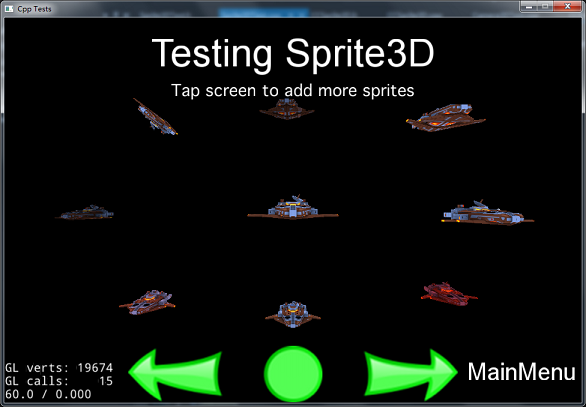
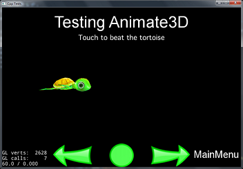
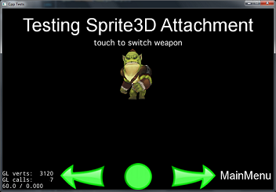
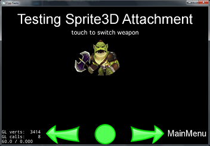
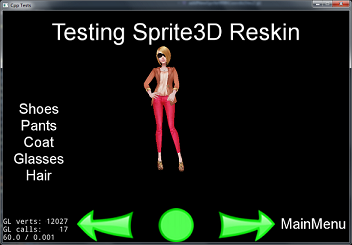
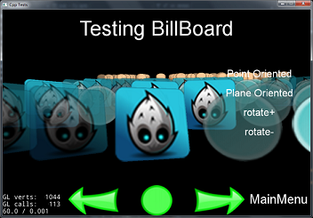

# 3D

## Sprite3D
Sprite3D works in many ways like a normal `Sprite`. Sprite3D is a three-dimensional model that includes the model, skeletal and rendering data needed to create the 3D Sprite. `Sprite3D` is derived from `Node` and therefore inherits most of `Nodes` functionality. `Sprite3D` supports the `.c3t`, `.c3b` and `.obj` formats. `Sprite3D` also supports running `Actions`.

It is easy to load and display a Sprite3D object:
```cpp
auto size = Director::getInstance()->getWinSize();

auto sprite = Sprite3D::create("Sprite3DTest/boss1.obj");
sprite->setScale(2.0f);
sprite->setRotation3D(Vec3(0.0f, 0.0f, 0.0f));
sprite->setPosition3D(Vec3(size.width * 2.f, size.height / 2.f, 0.0f));
sprite->setTexture("Sprite3DTest/boss.png");

addChild(sprite);
```
An example:



## Animation
After creating a Sprite3D model  it is possible to access the skeletal animation model.
```cpp
auto animation = Animation3D::create("Sprite3DTest/orc.c3b");
if (animation)
{
    auto animate = Animate3D::create(animation, 0.f, 1.933f);
    sprite->runAction(RepeatForever::create(animate));
}
```
An example:

  


## Combine 3D Models
You can add 3D models to other 3D models to make rich effects. An example would be adding a weapon to a character. For this use `AttachNode`:
```cpp
auto sp = Sprite3D::create("Sprite3DTest/axe.c3b");
sprite->getAttachNode("Bip001 R Hand")->addChild(sp);
```
An example:

  


## Grid Data
If the 3D model is compised from many pieces of grid data you can access the grid data model using the following functions:
```cpp
Mesh* getMeshByIndex(int index) const;
Mesh* getMeshByName(const std::string& name) const;
```

Using these it is possible to re-skin a model:
```cpp
auto sprite = Sprite3D::create("ReskinGirl.c3b");

// display the first coat
auto girlTop0 = sprite->getMeshByName("Girl_UpperBody01");
if(girlTop0)
{
    girlTop0->setVisible(true);
}

auto girlTop1 = sprite->getMeshByName("Girl_UpperBody02");
if(girlTop1)
{
    girlTop1->setVisible(false);
}

// swap to the second coat
auto girlTop0 = sprite->getMeshByName("Girl_UpperBody01");
if(girlTop0)
{
    girlTop0->setVisible(false);
}

auto girlTop1 = sprite->getMeshByName("Girl_UpperBody02");
if(girlTop1)
{
    girlTop1->setVisible(true);
}
```
The results:

  


Sprite3D提供了获取模型AABB的方法(AABB具体使用参看AABB部分的说明)，可通过如下函数获得：

    const AABB& getAABB() const;

Sprite3D提供了获取骨骼模型中骨骼的方法，可通过如下函数获取骨骼信息：

    Skeleton3D* skel = sprite->getSkeleton();

Skeleton3D是模型所有骨骼的容器，可以通过如下方法逐一获得单个骨骼节点并进行访问：

    Bone3D* getBoneByIndex(unsigned int index) const;
    Bone3D* getBoneByName(const std::string& id) const;

由于Skeleton3D在模型载入的时候就进行构建，用户并不需要手动进行创建，所以具体用法不在此进行说明。

**观察视角说明**

进行三维的操作不像二维操作只需要在一个平面，而是在一个三维空间中，在空间中的操作避免不了对观察的视角进行控制(从侧面、顶面查看模型等)，为此从cocos2d-x v3.3以后引入了相机的概念，如何通过控制相机来控制观察视角请参看Camera部分的说明，在此不再赘述。


###Mesh
#### 介绍
Mesh是真正可渲染物体数据和状态的集合，它包括了索引缓存，GLProgram状态集，纹理，骨骼，混合方程，AABB等。通常Mesh都是通过Sprite3D创建的时候由内部类进行构建的，不需要用户进行设置和使用。但对于高级用户来说，有时候可能并不需要通过外部导入模型的方式，而是直接通过顶点索引数据构建模型(例如平面，立方体，球体等)进行渲染。这时候就需要独立使用Mesh构建相应数据并自定义渲染Command来进行自定义绘制，所以有必要单独对Mesh的使用进行说明。
#### Mesh的使用
如何构建Mesh？通过Mesh的多个create方法都能创建Mesh，例如通过最常见的传入顶点数组，法线、纹理坐标和索引数组来创建一个四边形：

```cpp
    std::vector<float> positions;
    std::vector<float> normals;
    std::vector<float> texs;
    Mesh::IndexArray indices;

    positions.push_back(-5.0f);positions.push_back(-5.0f);positions.push_back(0.0f);
    positions.push_back(5.0f);positions.push_back(-5.0f);positions.push_back(0.0f);
    positions.push_back(5.0f);positions.push_back(5.0f);positions.push_back(0.0f);
    positions.push_back(-5.0f);positions.push_back(5.0f);positions.push_back(0.0f);

    texs.push_back(0.0f);texs.push_back(0.0f);
    texs.push_back(1.0f);texs.push_back(0.0f);
    texs.push_back(1.0f);texs.push_back(1.0f);
    texs.push_back(0.0f);texs.push_back(1.0f);

    indices.push_back(0);
    indices.push_back(1);
    indices.push_back(2);
    indices.push_back(0);
    indices.push_back(2);
    indices.push_back(3);

    auto mesh = Mesh::create(positions, normals, texs, indices);
    mesh->setTexture("quad.png");
```

构建Mesh后如何进行渲染？当我们构建完Mesh后已经拥有的渲染的所有信息，但还需要把相应的数据送入渲染管线才能进行渲染，所以可以考虑构建一个自定义的类从Node派生而来，重载Draw方法，并在Draw方法中构建一个MeshCommand并传入Mesh的相关数据送入渲染队列，最终进行渲染。例如自定义类中Draw方法中可添加如下代码：

```cpp
    auto programstate = mesh->getGLProgramState();
    auto& meshCommand = mesh->getMeshCommand();
    GLuint textureID = mesh->getTexture() ? mesh->getTexture()->getName() : 0;
    meshCommand.init(_globalZOrder
                    , textureID
                    , programstate
                    , _blend
                    , mesh->getVertexBuffer()
                    , mesh->getIndexBuffer()
                    , mesh->getPrimitiveType()
                    , mesh->getIndexFormat()
                    , mesh->getIndexCount()
                    , transform);
    renderer->addCommand(&meshCommand);
```
效果如下图：


**关于Sprite3D和Mesh的更多使用方法及用例请参看CppTest的Sprite3D例子**
    
## 3D Animations
### 介绍
一个模型可以包含一个或多个动画。动画是一个序列(关键帧)的转换被应用到模型的一个或多个节点。
### 如何导出
通过3DMAX制作一个人物动画称为“走”和“攻击”，通过3DMAX导出FBX动画模型，
然后通过Cocos2d-x编写的FBX转换程序将美术导出的FBX文件转换成c3t或c3b文件c3t文件为json格式的文本文件，用户可以直接打开来查看模型相关的信息，c3b为二进制文件不可直接打开查看，但是c3b格式具有文件小、加载速度快、等优点，所以在游戏发布时我们提倡使用c3b格式。
Cocos2d-x关键帧之间只支持线性插值。如果在模型制作中使用了其他插值方法,fbx-conv将产生额外的关键帧来补偿。这种补偿是根据目标帧完成。为了避免腹胀文件与额外的关键帧,一定要尽量使用线性插值。
### 如何创建使用
通过动画文件名字创建一个3D动画，如下所示:

```cpp
    auto animation = Animation3D::create(fileName);
    if (animation)
    {
       auto animate = Animate3D::create(animation); 
       animate->setSpeed(10);  
       sprite->runAction(animate);
    }
```
### 如何使用切分动画
通过传入动画数据、动画开始时间(单位秒)、动画长度参数(单位秒)可以把动画数据切分为多个动画使用，如下所示:

```cpp
    auto animation = Animation3D::create(fileName);
    if (animation)
    {
       //创建跑步动画
       auto runAnimate = Animate3D::create(animation，0,2); 
       runAnimate->setSpeed(10);  
       sprite->runAction(runAnimate);
       //创建攻击动画
       auto attackAnimate = Animate3D::create(animation，3,5); 
       attackAnimate->setSpeed(10);  
       sprite->runAction(attackAnimate);
    }
```
当使用sprite->runAction播放3D动画时，将从当前正在播放的动画过渡到将要播放的动画，当前动画权重由1降到0，将要播放的动画权重由0增加到1，过渡时间默认0.1秒，可以通过Animate3D::setTransitionTime来设置过渡时间。

##Camera
###介绍
相机概念自从3.3引入，相机用来观察场景中的物体。相机从Node继承，可以支持大部分Action。

cocos2d-x支持两种类型的相机，透视相机和正交相机。透视相机看的物体有近大远小的效果，正交相机看到的物体远近一样大。

透视相机示意图


正交相机示意图


##Camera的使用
每个Scene中会自动创建一个默认相机，默认相机的类型由Director::_projection来决定。如果需要多个相机或者对相机有更高级的操作要求，用户可以根据需要创建自己的相机，例如子定义的Layer的onEnter或者init中可以增加如下相机创建代码，

    // create a perspective camera
    auto s = Director::getInstance()->getWinSize();
    Camera* camera = Camera::createPerspective(60, (GLfloat)s.width/s.height, 1, 1000);
    
    // set parameter for camera
    camera->setPosition3D(Vec3(0, 100, 100));
    camera->lookAt(Vec3(0, 0, 0), Vec3(0, 1, 0));
    camera->setCameraFlag(CameraFlag::USER1);
    // you can also create a orthographic camera if you like
    addChild(camera); //add  camera to the scene
    setCameraMask(2);

正交相机的创建方法

    // create a perspective camera
    auto s = Director::getInstance()->getWinSize();
    Camera* camera = Camera::createOrthographic(s.width, s.height, 1, 1000);
    
如果同时存在多个相机，怎么标记某个物体被那些相机看到呢？

注意到Camera中有个_cameraFlag属性，为枚举类型，定义如下

    enum class CameraFlag
    {
        DEFAULT = 1,
        USER1 = 1 << 1,
        USER2 = 1 << 2,
        USER3 = 1 << 3,
        USER4 = 1 << 4,
        USER5 = 1 << 5,
        USER6 = 1 << 6,
        USER7 = 1 << 7,
        USER8 = 1 << 8,
    };
    
Node中有个_cameraMask的属性，当相机的_cameraFlag & _cameraMask为true时，该Node可以被该相机看到。所以在上述相机的创建代码中，camera的CameraFlag设置为CameraFlag::USER1，并且该layer的CameraMask为2，则表示该layer只能被CameraFlag::USER1相机看到。

Camera从Node继承，所以可以支持大部分Action，可以对相机进行任意的平移旋转操作。

Camera类还提供了由屏幕空间到世界空间的变换方法，

    void unproject(const Size& viewport, Vec3* src, Vec3* dst) const;
    
其中viewport为视口大小，src为屏幕坐标，src->z表示距离远近裁剪面信息，-1为近裁剪面，1为远裁剪面。dst为转换到世界空间的坐标

###常用相机介绍
一般游戏中都会有主角的概念，根据相机与主角的关系，我们将相机分成三种类型，第一人称相机，第三人称相机和自由相机。

第一人称相机，所看见的场景就是主角自己所看到的场景，相机位置大概在主角的头部，并且随着主角进行移动和旋转。

第三人称相机，以第三者的视角观察主角，并且跟随主角移动，有的也会跟随主角旋转。

自由相机，顾名思义，相机可以自由移动，不跟随主角的移动而移动。

三种相机的实现及使用方法参考CppTest中的Camera Test。

##AABB
###介绍
AABB 意思是轴对齐包围盒，一个3D的AABB就是一个简单的六面体，每一边都平行于一个坐标平面。如下图：


###AABB的性质:
特别重要的两个顶点为：Pmin = [Xmin Ymin Zmin]，Pmax = [ Xmax Ymax Zmax]。
盒子上的其他点都满足

Xmin <= X <= Xmax
Ymin <= Y <= Ymax
Zmin <= Z <= Zmax

###AABB的使用

通常在游戏中用AABB做一些非精确碰撞检测，AABB没有方向的概念，只有Pmin和Pmax两点，你可以通过这两个点来构建一个AABB盒子，代码如下：

AABB aabb(Vec(-1,-1,-1), Vec(1,1,1));

如果你想检测两个AABB是否发生碰撞可以调用 bool intersects(const AABB& aabb) const  函数，举个例子，我们创建两个AABB包围盒然后进行碰撞检测，代码如下：

AABB a(Vec(-1,-1,-1), Vec(1,1,1));
AABB b(Vec(0,0,0), Vec(2,2,2));
if(a.intersect(b))
{
    // 发生碰撞
}
else
{
    // 没发生碰撞
}

AABB做碰撞检测时只是与Pmin和Pmax两个点进行比较，所以AABB的碰撞检测速度很快。

除此之外，列举几个AABB常用的函数，如下：

void getCorners(Vec3 *dst) const;             // 获取AABB 8个顶点的世界坐标

bool containPoint(const Vec3& point) const;           // 检测一个点是否包含在AABB盒子内部

void merge(const AABB& box);              // 合并两个AABB盒子

void updateMinMax(const Vec3* point, ssize_t num); // 更新Pmin或Pmax

void transform(const Mat4& mat);              // 对AABB盒进行变换运算

##OBB
###介绍
OBB（Oriented Bounding Box，有向包围盒）是一个贴近物体的长方体，只不过该长方体可以根据物体任意旋转。OBB比包围球和AABB更加逼近物体，能显著减少包围体的个数。示意图：


###OBB的性质
OOBB包围盒是有方向的，我们用3个相互垂直的向量来描述OBB包围盒的本地坐标系，这3个向量分别是 _xAxis，_yAxis，_zAxis，用 _extents 向量来描述OBB包围盒在每个轴向上的长度。

###OBB的使用

你可以通过AABB构造OBB，代码如下：

AABB aabb(Vec(-1,-1,-1), Vec(1,1,1));
OBB obb(aabb);

或者你也可以直接通过8个点来构造

Vec3 a[]=
{
Vec3(0,0,0),Vec3(0,1,0),Vec3(1,1,0),Vec3(1,0,0),Vec3(1,0,1),Vec3(1,1,1),Vec3(0,1,1),Vec3(0,0,1)
};
OBB obb(a,8);

如果你想检测两个OBB是否发生碰撞可以调用 bool intersects(const OBB& aabb) const  函数，举个例子，我们创建两个OBB然后进行碰撞检测，代码如下

AABB aabbSrc(Vec(-1,-1,-1), Vec(1,1,1));
AABB aabbDes(Vec(0,0,0), Vec(2,2,2));
OBB obbSrc(aabbSrc);
OBB obbDes(aabbDes);
if(obbSrc.intersect(obbDes))
{
    // 发生碰撞
}
else
{
    // 没发生碰撞
}

除此之外，列举几个OBB常用的函数，如下：

void getCorners(Vec3 *dst) const;             // 获取OBB 8个顶点的世界坐标

bool containPoint(const Vec3& point) const;           // 检测一个点是否包含在OBB盒子内部

void transform(const Mat4& mat);              // 对OBB盒进行变换

##Ray
###介绍
Ray是射线，在游戏中做拾取用，例如在游戏中你需要选中一个角色，你可以在角色身上包围一个AABB盒子或OBB盒子，然后从屏幕上鼠标点中的位置向空间内引入一条射线，最后用射线与角色的包围盒进行碰撞检测。示意图：


###Ray的性质
Ray主要由两个向量来描述，一个是射线的原点 _origin 另一个是射线的方向 _direction

###Ray的使用

通常构建射线你需要知道射线的原点和方向，代码如下：

Ray ray(Vec3(0,0,0), Vec3(0,0,1));

这样你可以够着一个原点在Vec(0,0,0) 点，方向朝Z轴正方向的射线，当然你也可以通过已有射线来构建。

有了这条射线，就可以调用 intersects 函数跟空间内任意AABB盒子或OBB盒子碰撞，代码如下：

Ray ray(Vec3(0,0,0), Vec3(0,0,1));
AABB aabb(Vec(-1,-1,-1), Vec(1,1,1));
if(ray.intersects(aabb))
{
    // 射线跟AABB相交
}
else
{
    // 射线没有跟AABB相交
}

同理射线与OBB进行相交检测道理一样：

Ray ray(Vec3(0,0,0), Vec3(0,0,1));
AABB aabb(Vec(-1,-1,-1), Vec(1,1,1));
OBB obb(aabb);
if(ray.intersects(obb))
{
    // 射线跟OBB相交
}
else
{
    // 射线没有跟OBB相交
}

除此之外，列举几个Ray常用的函数，如下：

void transform(const Mat4& mat);              // 对Ray进行变换

##BillBoard
### 介绍
BillBoard是一种在游戏中十分常见渲染技巧，一般情况下用一个带纹理的平面模型(例如四边形)来代替三维模型，并且让该平面始终面向观察摄像机，这样的好处是在保留了模型的三维立体感的基础上极大的提高了渲染效率。常见于树木、粒子特效的渲染中。cocos2d-x也从V3.3版本之后开始支持该技术，关于该技术更详细的介绍请查阅相应文献。


### BillBoard的使用
如何创建BillBoard并显示？cocos2d-x的BillBoard从Sprite派生而来，所以支持Sprite的大部分功能(可参看Sprite的用法)。BillBoard提供了多个create方法，如下所示：

    static BillBoard* create(Mode mode = Mode::VIEW_POINT_ORIENTED);
    static BillBoard* create(const std::string& filename, Mode mode = Mode::VIEW_POINT_ORIENTED);
    static BillBoard* create(const std::string& filename, const Rect& rect, Mode mode = Mode::VIEW_POINT_ORIENTED);
    static BillBoard* createWithTexture(Texture2D *texture, Mode mode = Mode::VIEW_POINT_ORIENTED);

Mode是BillBoard的朝向模式，目前支持两种朝向，一种是面向相机的原点(默认方式)，另一种是面向相机的XOY平面，如下所示：

    enum class Mode
    {
        VIEW_POINT_ORIENTED, // orient to the camera
        VIEW_PLANE_ORIENTED // orient to the XOY plane of camera
    };

我们可以通过如下方式创建面向相机的原点的BillBoard：

        auto billborad = BillBoard::create("Images/Icon.png", BillBoard::Mode::VIEW_POINT_ORIENTED);

或者可以通过如下方式创建面向相机XOY平面的BillBoard：

        auto billborad = BillBoard::create("Images/Icon.png", BillBoard::Mode::VIEW_PLANE_ORIENTED);

之后设置相关的属性：

        billborad->setScale(0.5f);
        billborad->setPosition3D(Vec3(0.0f, 0.0f, 0.0f));
        billborad->setBlendFunc(cocos2d::BlendFunc::ALPHA_NON_PREMULTIPLIED);
        billborad->setOpacity(200);
        addChild(billborad);

两种朝向模式的效果如下所示(左图为原点朝向，右图为平面朝向)：

 

**如果想了解BillBoard的实现机制可参看BillBoard源码中Draw部分的代码**

cocos2d-x从BillBoard引入后在Renderer类中增加了一个透明渲染队列，为了保证透明物体的正确渲染，该队列在其他队列渲染后进行渲染，并且该队列按照指定的Order值从大到小进行排序。在BillBoard的渲染中，BillBoard传递给透明队列自身在摄像机坐标系下的-Z值(离摄像机越远的物体该值越大)大小，进而能够实现BillBoard的正确的渲染。如果用户需要自定义渲染透明对象时可以考虑使用该队列，该队列的添加方式如下所示：

        _quadCommand.init(_zDepthInView, _texture->getName(), getGLProgramState(), _blendFunc, &_quad, 1, _billboardTransform);
        renderer->addCommandToTransparentQueue(&_quadCommand);

**BillBoard更多的使用方法和细节请参看cpptests用例中的BillBoardTest**

##Fbx-conv Guide
Cocos2d-x's Fbx-conv is based on the libgdx’s fbx-conv, use the conversion program you can convert the FBX file that exported by art into c3t or c3b file. c3t file as a text file format users can open it directly, c3b is binary files that can’t be opened directly, but c3b format is more smaller and faster for loading, so when the game is released we advice the user to use c3b format.
###Usage：
Open a command line and enter into the fbx-conv directory, and then input the full path fbx-conv executable file (you can drag fbx-conv to command line directly) and then enter the parameters -a (-a means export both of c3t and c3b file, if parameter is empty we export c3b file by default), and then enter the file name which you want to convert.

command line:
fbx-conv -a boss.FBX

OK，you can find the c3t and c3b file at the FBX file directory if succeed。

###Parameter Description:
If you use the -? parameter you will see the help information, you can find the parameter’s explanation which you want. 

###Note：
1.  model need to have a material that contain one texture at least.
    
2.  About animation, we just support skeletal animation.
    
3.  Just one skeletal animation object and no support multiple skeleton.
    
4.  You can export multiple static model , so you can support a static scene.
    
5.  The maximum amount of vertices or indices a mesh should less than 32767
    

