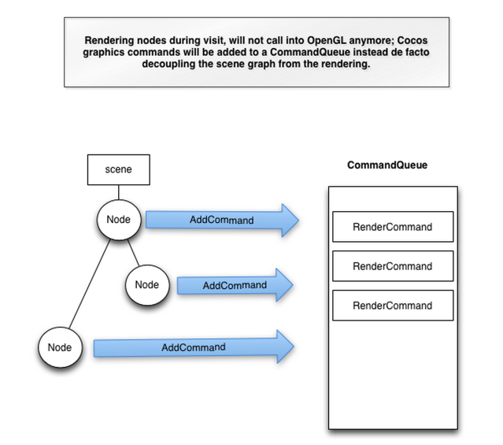
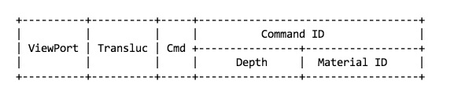

Cocos2d v3.0 renderer pipeline roadmap
=====================================

## Why (the vision)
The way currently Cocos2d does rendering is good but it is beginning to feel somehow antiquate and moreover it doesn’t actually leverage modern multi core CPUs so popular nowadays on most modern tablets and mobile phones.
So we want to re design Cocos renderer, for making it more performing, elegant, scalable, flexible but still simple to use and to understand. Also we want to maintain that same familiar API that current Cocos2d users will feel immediately comfortable with, without having to bother about what’s changed or new under the hood.
We will do this maintaining the same key cornerstone concepts Cocos2d users get to know and like as Scenes, Nodes, Layers, Sprites.  

## What (the goals)
Here is a high level view of the new features and improvements we would like to achieve in Cocos2d v.3.0:

- Decouple the scene graph from the renderer
Visiting nodes issues graphics commands and put them on a queue, but doesn’t actually invoke any OpenGL rendering code  

- Viewing frustum Geometry culling
Sprites (and geometries more in general) not visible from the camera’s point of view be automatically removed from the current frame and not rendered

- Rendering on a thread
The execution of all the rendering commands (i.e. OpenGL calls) will be moved to different thread than the main one (this will allow for better parallelism and usage of more than one CPUs cores where possible)

- Automatic batching
Efficiently reduces the number of draw calls (automatically) batching them together when possible (i.e. sprites using the same material)

- (Node based) Customizable rendering
As in the current version of Cocos, users will still be able (if needed) to customize rendering on a per node basis, calling OpenGL commands directly, disregarding the official renderer (but possibly incurring on worst performances) 

- Optimized for 2D, but suitable for 3D as well
The new renderer should be optimized for 2D games, but it should be capable of handling 3D objects as well.

## How (the plan)
Central to the new design is the notion RenderQueue. While visiting a node, rendering will not call OpenGL commands directly anymore (as currently is the case); it will instead push RenderCommands to the RenderQueue. Commands In the queue will subsequently be read by the rendering backend, processed as needed and pushed to the actual rendering API (i.e. OpenGL) (see picture)

The rendering backend (running on his own thread) will in turn sort the commands based on a key, pop the sorted commands from the queue, process them and actually execute them. Any locking or CPU expensive OpenGL commands will be then executed from the back-end thread, letting Cocos’ main thread free continue working on parsing the scene graph or doing other non rendering related tasks. This will help parallelism and will allow for using multi core CPU’s (see picture)

“Push commands” will run on the cocos2d’s main thread. While “sort commands” and “execute commands” will run on the RenderQueue background thread.

## Commands

A command could be anything, from “Draw Quad”, to “Execute this chunk of OpenGL”.

Each Command has a Material. The Material is a combination of:
- Texture Id
- Shader Program Id
- Blend function
Other states can be added as well.

Additionally Each command has a 64-bit key. And the key is used to sort the commands. Command with a lower key will be executed before Commands with higher key.

### Generating Keys
work in progress

The key is composed of:
- Viewport: 3 bits
- Opaque / Translucent: 1 bit
- Cmd + Command ID: 1bit + 32 bits
- Depth: 24 bits
- Material ID:  24 bits

If the Translucent bit is off (meaning it is an opaque object), then the Depth field will be negated, since opaque objects needs to be drawn Front-to-Back; while translucent objects needs to be drawn Back-To-Front.

Also, by having the translucent bit off (opaque on), it means that all Opaque objects will be drawn before the Translucent.

### Quad Commands
The RenderCommandQuads is a predefined Command that populates the Buffer (VBO) with one or more Quads. This Command is going to be used by Sprite (1 Quad per sprite), but TileMap (multiple Quads), SpriteBatchNode (multiple Quads), and DrawNode (multiple Quads)

### OpenGL Commands
It is possible to create commands that execute custom OpenGL calls (like in cocos2d v2.x).
In order to do so, the user will need to create a RenderCommandOpenGL and set the xxx property with a lambda object with the OpenGL calls.

The developer is responsible for restoring the Render Queue State after the RenderCommandOpenGL is executed.

Executing RenderCommandOpenGL commands, although it is very handy, it also could be expensive due to the different context switches that might occur. And it also flushes the Quad’s Buffer (see Auto Batching)

### 3D Commands
Although the renderer is optimized for 2d games, support for 3D objects is also supported.
In order to render a 3D objects, developers should use a subclass of Command and implement the needed features in that command.

### Group Commands
The RenderCommandGroup is an special command that tells the renderer:
- The following Commands shall be grouped together
- They shall not be sorted with the rest of the ‘global’ Commands. Instead, a sort should be performed among them.

Usage:
- For ClippingNode
    - Its children should be drawn according to the Clipping rules
- For RenderTexture
    - Its children should be drawn on a new texture
- For any other node that needs to perform effects only in its children

## Auto Batching
With Cocos2d-x 3.00 we also want to introduce the concept of automatic batching.  In fact we believe reducing the number of draw calls and render device state changes will improve drastically rendering speed.
Additionally, RenderQueue will use a buffer to draw Quads (Sprites, Tiles, Drawing primitives). The only requirement for the Quads is that each vertex of the Quad should have these 3 properties:
- Vertex: 3 floats (x,y,z)
- Texture coordinates: 2 floats  (u,v)
- Color: 4 bytes  (r,g,b,a)

The Quads are not required to share the same Material.  But if all the Quads share the same material, then only one draw call will be used (automatic batching). 
A very simplified version of automatic batching algorithm works like this:
1. A new Quad is added to the Buffer
2. If the new Quad shares the same Material as the previous Quad, nothing happens.
3. However, if the new Quad has a different Material than the previous Quad, then the previous Quads are drawn.

Only one Buffer (VBO) will be used in order to minimize buffer switches.
The buffer will have a maximum capacity of 10922 Quads (65536 / 6 ). If the Buffer is full, then the Buffer will be flushed (all the undrawn Quads will be drawn), and it will be ready to be used again.

## Auto Culling
Auto Culling will be performed in the cocos2d main thread.
A check will be done for each node: If the AABB of the node is outside the frustum, then no Commands will be submitted to the RenderQueue.

## Implementation details

### Nodes
#### ClippingNode
Possible implementation:

It should override visit, and send a “Push Group;Push Clipping Area;Set Clipping Area” command.
Before leaving visit, it should do “Pop Clipping Area; Pop Group” Command.
The Renderer should have the functionality to create Clipping Areas.

#### DrawNode
Research is needed, but RenderCommandQuads seems possible.
Most probably it will need its own Shader, to batching with other nodes might not be possible.

#### Label
It should use RenderCommandQuads.
The default shader is good enough, but if Distance Field is implemented, it might need to use its own shader, so batching it with other nodes might not be possible.

#### Layer
It is a void Node. No Command will be sent to the queue.
#### LayerColor, LayerGradient
These nodes should be removed and replaced with DrawNode. 
If the are not removed, they should use RenderCommandQuads.

#### Menu
It is a void Node. No Command will be sent to the queue.

#### MenuItem
MenuItemImage, MenuItemSprite, MenuItemLabel should use a RenderCommandQuads.
#### MotionStreak
TBD

### Node
It is a void Node. No Command will be sent to the queue.

#### ParallaxNode
It is a void Node. No Command will be sent to the queue.

#### ParticleSystem
ParticleSystem uses an array of V3F_C4B_T2F_Quad to render the particles. So, a RenderCommandQuads is enough, making it possible to batch sprites and particles alltogether.

#### ParticleSystemBatchNode
Same as ParticleSystem, but most probably it will be safe to remove this node.
#### ProgressTimer
TBD
#### RenderTexture
Possible implementation:
It should override visit, and send a “Push Group Command;Push Texture;Switch To Texture” command.
Before leaving visit, it should do “Pop Texture; Pop Group” Command.
The Renderer should have the functionality to create new Render Textures.
#### Scene
It is a void Node. No Command will be sent to the queue.

#### Sprite
It sends a RenderCommandQuads with only one Quad.
#### SpriteBatchNode
It sends  one RenderCommandQuads command with as many Quads as Sprites are contained in the batch.
It is worth noting the the contained Sprites won’t be sorted by the Renderer. Instead, the RenderCommandQuads will be sorted based on the values of SpriteBatchNode, and not based on its children’s values.
#### TextField

#### TMXTiledMap
Same as SpriteBatchNode.

#### Renderer Pseudo Code
https://gist.github.com/ricardoquesada/7049216

## Reference

- [Triple your frame rate?](http://www.panda3d.org/blog/?p=206)
- [Order your graphics call around ](http://realtimecollisiondetection.net/blog/?p=86)
- [Flexible Rendering for Multiple Platforms (GDC2012)](http://bitsquid.se/presentations/flexible-rendering-multiple-platforms.pdf)
- [Doom3 BFG Source Code Review](http://fabiensanglard.net/doom3_bfg/)
- [GPU PRO 3: Advanced Rendering Techniques: Data Driven Renderer](http://www.crcpress.com/product/isbn/9781439887820)
- [Implementing a Render Queue for Games](http://ploobs.com.br/?p=2378)
- [Refactoring the engine: the rendering subsystem](http://www.klopfenstein.net/lorenz.aspx/refactoring-the-engine-the-rendering-subsystem)
- [Multithreaded Renderloop](http://blog.slapware.eu/game-engine/programming/multithreaded-renderloop-part1/)
- [Renderstate change cost](http://home.comcast.net/~tom_forsyth/blog.wiki.html#[[Renderstate%20change%20costs]])
- [Input Latency](http://realtimecollisiondetection.net/blog/?p=30)
- [Do it yourself Game Task Schedule](https://software.intel.com/en-us/articles/do-it-yourself-game-task-scheduling)
- [Learning to Love your Z-buffer](http://www.sjbaker.org/steve/omniv/love_your_z_buffer.html)
- [Qt Quick Scene Graph Renderer](http://doc-snapshot.qt-project.org/qt5-stable/qtquick-visualcanvas-scenegraph-renderer.html)
- [UITableViewCell Class Reference](https://developer.apple.com/library/ios/documentation/uikit/reference/UITableViewCell_Class/Reference/Reference.html)

Misc:
- [Gingko Game Loop](http://www.altdevblogaday.com/2011/02/23/ginkgos-game-loop/)
- [Introducing Gingko](http://www.brokenrul.es/blog/?p=568#.UkSsgbx5H5c)
- [The Impossible Fast C++ delegates](http://www.codeproject.com/Articles/11015/The-Impossibly-Fast-C-Delegates)
- [A Dynamic Component Architecture for High Performance Gameplay](https://d3cw3dd2w32x2b.cloudfront.net/wp-content/uploads/2011/06/6-1-2010.pdf)
- [Question about the usage of glDepthMask](http://stackoverflow.com/questions/3388294/opengl-question-about-the-usage-of-gldepthmask/3390094#3390094)