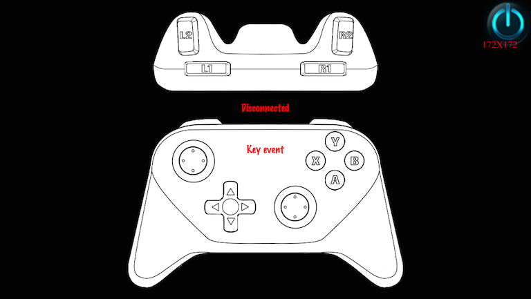
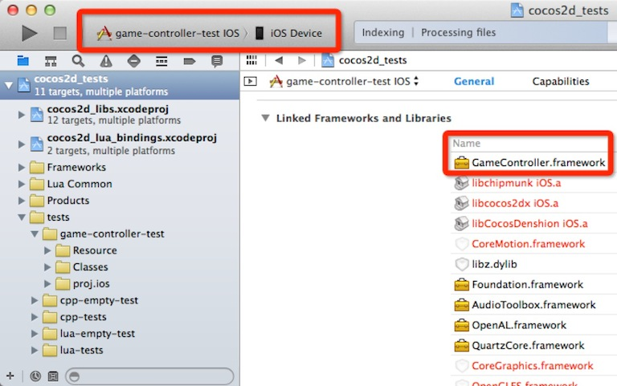

#Game Controller

## Overview ##

This tutorial will introduce you to supporting ios and Android game controllers in Cocos2d-x v3.2 rc0.

## Game controller test ##

### iOS

Using these steps to test game controller

* open cocos2dx_root/cocos2d_tests.xcodeproj
* select `game-controller-test`
* build and install on iOS device
* connect iOS device to controller and start `game-controller-test`

### Android

```
$ cd cocos2dx_root/build
$ ./android-build.py game-controller-test -p 16
$ adb connect IP_OF_TV
$ adb install ../tests/game-controller-test/proj.android//bin/GameControllerTest-debug.apk
$ adb shell am start -n org.cocos2dx.game_controller_test/.AppActivity
```

* IP_OF_TV: ip address of amazon tv, can get it by `Settings->SYSTEM->About->NetWork` on Amazon Fire TV, and `MANAGE->SYSTEM->ADVANCED->Wi-fi->connected wifi` on Ouya. Android device and developing machine should be in the same network.
* Can not connect more than one Android devices when installing Android application
* You should turn on `adb over network`. You can turn on it on Ouya through `MANAGE-->SYSTEM-->DEVELOPMENT-->ADB OVER NETWORK`, and turn on it on Amazon Fire TV through `Settings-->SYSTEM-->Developer Options-->ADB debugging`.
* If you want to test `Nibiru`, you should install corresponding application before running this test case.

Your screen should look like the picture below. If you press any keys on your controller device. The corresponding keys on your screen will highlight.



##Game controller events##

Game controller is a event listener called `EventListenerController` in Cocos2d-x. There are 6 events of controller listener: `onConnected` ,`onDisconnected`, `onKeyDown`, `onKeyUp`, `onAxisEvent`, `onKeyRepeat`. `onAxisEvent` is the event when the analog stick changed. The `KeyCode` refers to the key type in your interaction. The list and picture shows the `KeyCode` and its corresponding key of the controller. 

```cpp
enum Key
{
    JOYSTICK_LEFT_X = 1000,
    JOYSTICK_LEFT_Y,
    JOYSTICK_RIGHT_X,
    JOYSTICK_RIGHT_Y,
        
    BUTTON_A,
    BUTTON_B,
    BUTTON_C,
    BUTTON_X,
    BUTTON_Y,
    BUTTON_Z,
          
    BUTTON_DPAD_UP,
    BUTTON_DPAD_DOWN,
    BUTTON_DPAD_LEFT,
    BUTTON_DPAD_RIGHT,
    BUTTON_DPAD_CENTER,

    BUTTON_LEFT_SHOULDER,
    BUTTON_RIGHT_SHOULDER,

    AXIS_LEFT_TRIGGER,
    AXIS_RIGHT_TRIGGER,

    BUTTON_LEFT_THUMBSTICK,
    BUTTON_RIGHT_THUMBSTICK,

    BUTTON_START,
    BUTTON_SELECT,

    BUTTON_PAUSE,
    KEY_MAX
 };
```


There are 3 kinds statuses of a key. If `isAnalog` is true, the `value` might be a float from -1 to 1. If `isAnalog` is false, the `value` would be a centain number like 0 or 1. If depends on your key and the game controller. For example, if your key is `JOYSTICK_LEFT_X`, then its `isAnalog` would be true and the `value` is a float from -1 to 1 which represent your left joystick's X-axis value.

```cpp
typedef struct _keyStatus
{
    bool isPressed;
    float value;
    bool isAnalog;
}KeyStatus;
```

The codes below shows how to use these events in your project.

```cpp
void HelloWorld::registerControllerListener()
{
    //create an evnetListenerController
    _listener = EventListenerController::create();
        
    //bind onConneected event call function
    _listener->onConnected = CC_CALLBACK_2(HelloWorld::onConnectController,this);

    //bind disconnect event call function
        _listener->onDisconnected = CC_CALLBACK_2(HelloWorld::onDisconnectedController,this);
        
        //bind onKeyDown event call function        
        _listener->onKeyDown = CC_CALLBACK_3(HelloWorld::onKeyDown, this);
        
        //bind onKeyUp event call function   
        _listener->onKeyUp = CC_CALLBACK_3(HelloWorld::onKeyUp, this);

        //bind onAxis event call function, onAxis will be called when analog stick is changed
        _listener->onAxisEvent = CC_CALLBACK_3(HelloWorld::onAxisEvent, this);
        
    //Activate the listener into the event dispatcher
        _eventDispatcher->addEventListenerWithSceneGraphPriority(_listener, this);
        
    //This function should be called for iOS platform
    Controller::startDiscoveryController();
}
    
//Controller is the obejects of the Controller，keyCode means the keycode of the controller you click down
void HelloWorld::onKeyDown(cocos2d::Controller *controller, int keyCode, cocos2d::Event *event)
{
    CCLOG("KeyDown:%d", keyCode);
}   
    
void HelloWorld::onKeyUp(cocos2d::Controller *controller, int keyCode, cocos2d::Event *event)
{
    //You can get the controller by tag, deviceId or devicename if there are multiple controllers
    CCLOG("tag:%d DeviceId:%d DeviceName:%s", controller->getTag(), controller->getDeviceId(), controller->getDeviceName().c_str());
    CCLOG("KeyUp:%d", keyCode);
}
    
//The axis includes X-axis and Y-axis and its range is from -1 to 1. X-axis is start from left to right and Y-axis is bottom to top.
void HelloWorld::onAxisEvent(cocos2d::Controller* controller, int keyCode, cocos2d::Event* event)
{
    const auto& keyStatus = controller->getKeyStatus(keyCode);
    CCLOG("Axis KeyCode:%d Axis Value:%f", keyCode, keyStatus.value);
}   
    
void HelloWorld::onConnectController(Controller* controller, Event* event)
{           
    CCLOG("Game controller connected");
}
    
void HelloWorld::onDisconnectedController(Controller* controller, Event* event)
{
    CCLOG("Game controller disconnected");
}
        
bool HelloWorld::init()
{
    //////////////////////////////
    // 1. super init first
    if ( !Layer::init() )
    {
        return false;
    }       
    ......
    ......          
     registerControllerListener();
        
    return true;
}
```

##How to integrate game controller to iOS devices 

###1. Connect device

To support game controller in iOS devices, you need `iOS 7.0` above.  You also need to connect your controller to your iOS device. We supports the standard iOS game controllers now. But different devices may have similar methods to link. (Please read the instructions of your game controller). In this sample, we used PowerShell, which supports iPhone 5/5C/5S and iPod touch 5th generation. It is easy to connect PowerShell, just insert your devices in it.

###2. Add GameController.Framework 

If you are a new comer and you don't know how to create a Cocos2d-x project on iOS, read this article first:[How_to_Start_A_New_Cocos2D-X_Game](http://www.cocos2d-x.org/wiki/How_to_Start_A_New_Cocos2D-X_Game). Next you need to add GameController.Framework (iOS 7.0 above). See the picture below.



###3. Write your controller event 

Read the [Game-controller-event](#user-content-game-controller-event) and write your own code in your program. Then run it on the real devices.

PS: `Controller::startDiscoveryController()` must be invoked otherwise the controller is invalid. We suggest you put it in your initialize function.

## How to integrate game controller to Android devices

###1. Connect device

To connect the game controller, read the instructions of your game controller please. `Cocos2d-x v3.2 supports the standard Android game controllers, Ouya TV controllers, Amazon fire TV controllers, Moga controllers and Nibiru controllers.` Here we choose Nibiru Android GamePad as the sample. We download and install the apk for the controller's driver. Then open the app to link the game pad. 


###2. Add libControllerManualAdapter

If you are a new comer and you don't know how to create a Cocos2d-x project on iOS, read this article first:[How_to_Build_an_Android_Project_with_Eclipse](http://www.cocos2d-x.org/wiki/How_to_Build_an_Android_Project_with_Eclipse). But the game controller feature is an independent lib named `libControllerManualAdapter`. You need to add this lib to your eclipse android project. The path is `Cocos2d-x path/platform/android/ControllerManualAdapter `and it can be compiled only on `Android sdk 4.1.2 above` . 


###3. Modify AppActivity.java

Modify the `AppActivity.java` like the sample below.

```java
import org.cocos2dx.lib.GameControllerActivity;
import android.os.Bundle;

public class AppActivity extends GameControllerActivity {
    
    @Override
    protected void onCreate(Bundle savedInstanceState) {        
        super.onCreate(savedInstanceState);

        //The standard controller,without doing anything special. e.g: Amazon Fire TV   
        //Manually specify an adapter.
        this.connectController(DRIVERTYPE_NIBIRU);
        //this.connectController(DRIVERTYPE_MOGA);
        //this.connectController(DRIVERTYPE_OUYA);
    }
}
```

###4. Compile and run